# Lab: Automate business processes with Logic Apps

# Student lab answer key

### Exercise 1: Create Azure resources

#### Task 1: Open the Azure portal

1. On the taskbar, select the **Microsoft Edge** icon.

1. In the open browser window, go to the Azure portal (<https://portal.azure.com>).

1. Enter the email address for your Microsoft account, and then select **Next**.

1. Enter the password for your Microsoft account, and then select **Sign in**.

   > **Note**: If this is your first time signing in to the Azure portal, you'll be offered a tour of the portal. Select **Get Started** to skip the tour.


#### Task 2: Create an API Management resource

1. In the Azure portal's navigation pane, select **Create a resource**.

1. From the **New** blade, find the **Search the Marketplace** text box.

1. In the search box, enter **API**, and then select Enter.

1. From the **Marketplace** search results blade, select the **API Management** result.

1. From the **API Management** blade, select **Create**.

1. From the **API Management Service** blade, perform the following actions:

   1.  In the **Name** text box, enter **prodapim*[yourname]***.

   1.  Leave the **Subscription** text box set to its default value.

   1.  In the **Resource group** section, select **Create new**, in the text box enter **AutomatedWorkflow**, and then select **OK**.

   1.  In the **Location** list, select **East US**.

   1.  In the **Organization name** text box, enter **Contoso**.

   1.  Leave the **Administrator email** text box set to its default value.

   1.  In the **Pricing tier** list, select **Consumption (99.9 SLA, %)**, and then select **Create**.

   > **Note**: Wait for Azure to finish creating the API Management resource prior to moving on in the lab. You will receive a notification when the resource is created.


#### Task 3: Create a Logic App resource

1. In the navigation pane of the Azure portal, select **+ Create a resource**.

1. On the **New** blade, locate the **Search the Marketplace** field.

1. In the search field, enter **Logic**, and then select Enter.

1. On the **Everything** search results blade, select **Logic App**.

1. On the **Logic App** blade, select **Create**.

1. On the **Logic App** blade, review the tabs on the blade, such as **Basics**, **Tags**, and **Review + Create**.

   > **Note**: Each tab represents a step in the workflow to create a new logic app. You can select **Review + Create** at any time to skip the remaining tabs.

1. Select the **Basics** tab, and then in the tab area, perform the following actions:

   1.  Leave the **Subscription** field set to its default value.

   1.  In the **Resource group** list, select **Use existing**, and then select the **AutomatedWorkflow** group you created earlier in the lab.

   1.  In the **Logic App name** field, enter **prodflow*[yourname]***.

   1.  In the **Select the location** section, select **Region**.

   1.  In the **Location** list, select **East US**.

   1.  In the **Log Analytics** section, select **Off**.

   1.  Select **Review + Create**.

1. On the **Review + Create** tab, review the options that you specified in the previous steps.

1. Select **Create** to create the logic app by using your specified configuration.

   > **Note**: Wait for Azure to finish creating the Logic Apps resource prior to moving on in the lab. You will receive a notification when the resource is created.

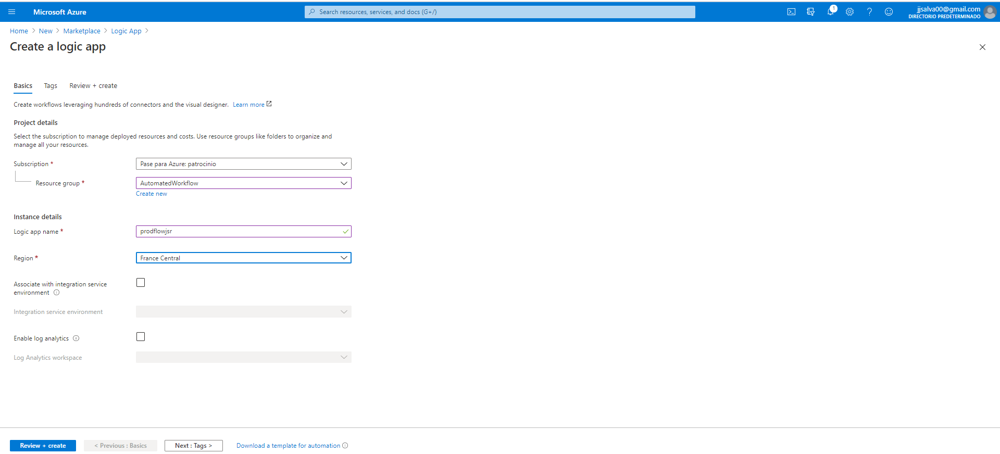


#### Task 4: Create a storage account

1. In the Azure portal navigation pane, select **All services**.

1. On the **All services** blade, select **Storage Accounts**.

1. On the **Storage accounts** blade, get your list of storage account instances, and then select **Add**.

1. On the **Create storage account** blade, review the tabs on the blade, such as **Basics**, **Tags**, and **Review + Create**.

   > **Note**: Each tab represents a step in the workflow to create a new storage account. You can select **Review + Create** at any time to skip the remaining tabs.

1. Select the **Basics** tab, and then in the tab area, perform the following actions:

   1.  Leave the **Subscription** text box set to its default value.

   1.  In the **Resource group** section, select the **AutomatedWorkflow** group you created earlier in the lab.

   1.  In the **Storage account name** text box, enter **prodstor*[yourname]***.

   1.  In the **Location** list, select the **(US) East US** region.

   1.  In the **Performance** section, select **Standard**.

   1.  In the **Account kind** list, select **StorageV2 (general purpose v2)**.

   1.  In the **Replication** list, select **Locally-redundant storage (LRS)**.

   1.  In the **Access tier (default)** section, ensure that **Hot** is selected.

   1.  Select **Review + Create**.

1. On the **Review + Create** tab, review the options that you specified in the previous steps.

1. Select **Create** to create the storage account by using your specified configuration.

   > **Note**: On the **Deployment** blade, wait for the creation task to complete before moving on in this lab.

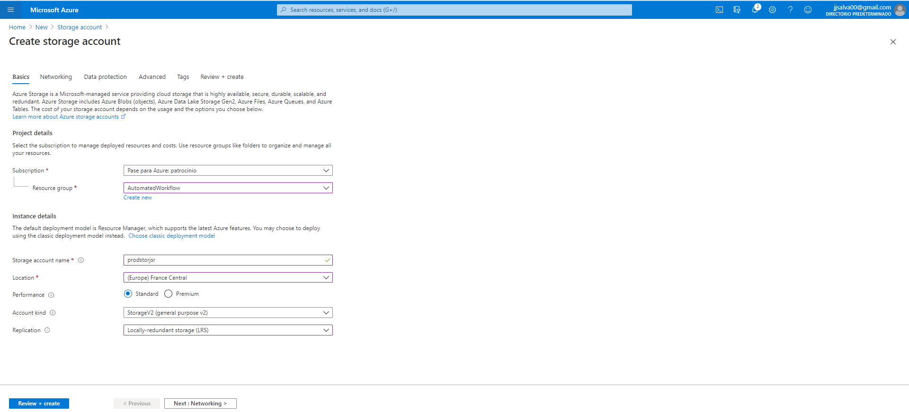


#### Task 5: Upload sample content to Azure Files

1. In the Azure portal navigation pane, select the **Resource groups** link.

1. On the **Resource groups** blade, find and then select the **AutomatedWorkflow** resource group that you created earlier in this lab.

1. On the **AutomatedWorkflow** blade, select the **prodstor*[yourname]*** storage account that you created earlier in this lab.

1. On the **Storage account** blade, in the **File service** section, select the **File shares** link.

1. In the **File shares** section, select **+ File share**.

1. In the **File share** pop-up dialog box, perform the following actions:

   1.  In the **Name** text box, enter **metadata**.

   1.  In the **Quota** text box, enter **1** (GiB).

   1.  Select **Create**.

   

   

1. Back in the **File shares** section, select the recently created **metadata** share.

1. On the **File share** blade, select **Upload**.

1. In the **Upload files** dialog box, perform the following actions:

   1.  In the **Files** section, select the **Folder** icon.

   1.  In the **File Explorer** window, browse to **Allfiles (F):\\Allfiles\\Labs\\09\\Starter**, select the following files, and then select **Open**:

       -   **item_00.json**

       -   **item_01.json**

       -   **item_02.json**

       -   **item_03.json**

       -   **item_04.json** 

   1.  Ensure that the **Overwrite if files already exist** check box is selected, and then select **Upload**. 

   > **Note**: Wait for the blob to upload before you continue with this lab.


#### Review

In this exercise, you created all the resources that you'll use for this lab.

### Exercise 2: Implement a workflow using Logic Apps

#### Task 1: Create a trigger for the workflow

1. In the Azure portal navigation pane, select **Resource groups**.

1. On the **Resource groups** blade, select the **AutomatedWorkflow** resource group that you created earlier in this lab.

1. On the **AutomatedWorkflow** blade, select the **prodflow*[yourname]*** logic app that you created earlier in this lab.

1. On the **Logic Apps Designer** blade, select the **Blank Logic App** template.

   

1. In the **Designer** area, perform the following actions to add a **When a HTTP request is received (Request)** trigger:

   1. In the **Search connectors and triggers** field, enter **HTTP**.

      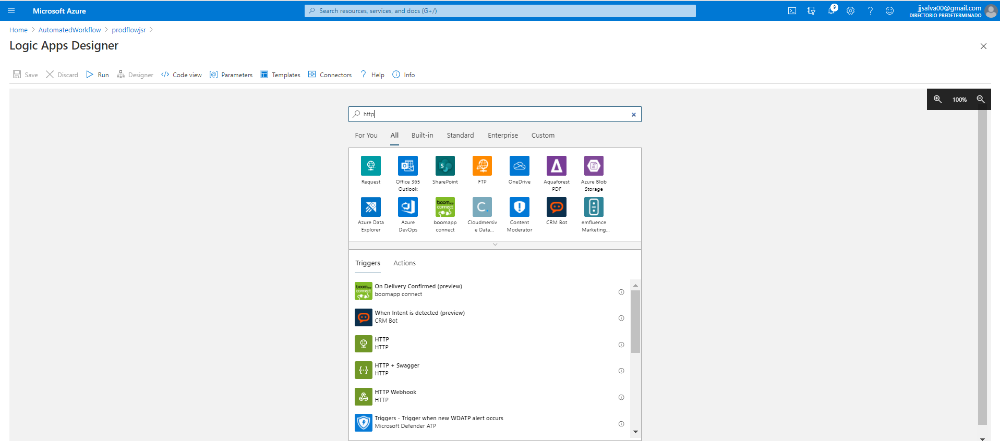

   1. In the category list, select **Request**.

      

   1. In the **Triggers** result list, select **When a HTTP request is received**.

      

1. In the **When a HTTP request is received** area, perform the following actions to configure the **When a HTTP request is received (Request)** trigger:

   1. In the **Add new parameter** list, select **Method**.

      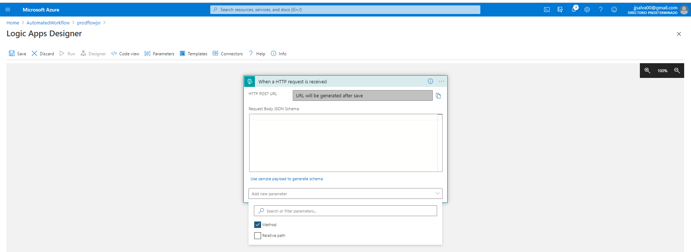

   1. In the **Method** list, select **GET**.

      

#### Task 2: Create an action to query Azure Storage file shares

1. In the **Designer** area, select **+ New step**, and then perform the following actions to add a **List files (Azure File Storage)** action:

   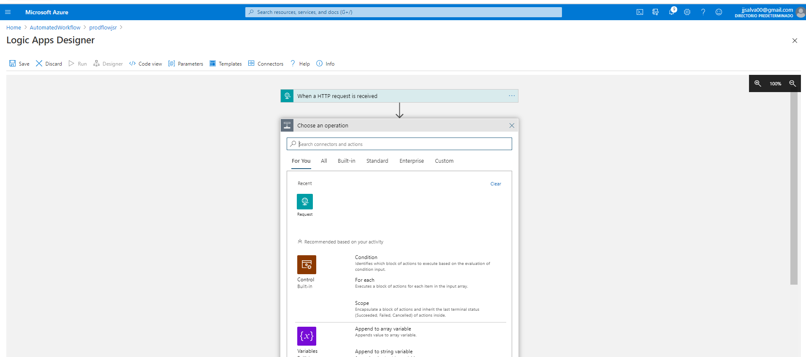

   1. In the **Search connectors and triggers** field, enter **files**.

      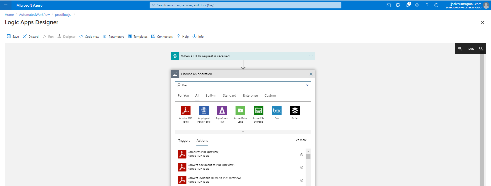

   1. In the category list, select **Azure File Storage**.

      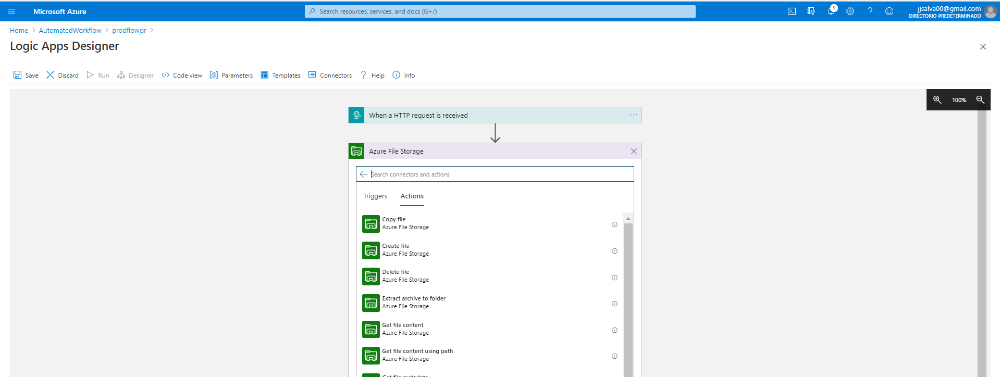

   1. In the **Actions** result list, select **List files**.

      

   1. In the **Connection Name** field, enter **filesConnection**.

      

   1. In the **Storage Account** section, select the **prodstor*[yourname]*** storage account that you created earlier in this lab, and then select **Create**.

      

   1. Wait for the connector resource to finish creating.

      > **Note**: These resources take one to five minutes to create.

   

1. In the **List files** area, in the **Folder** text box, enter **/metadata**.

   

#### Task 3: Create an action to project list item properties

1. In the **Designer** area, select **+ New step**.

1. In the **Designer** area, perform the following actions to add an **Select (Data Operations)** action:

   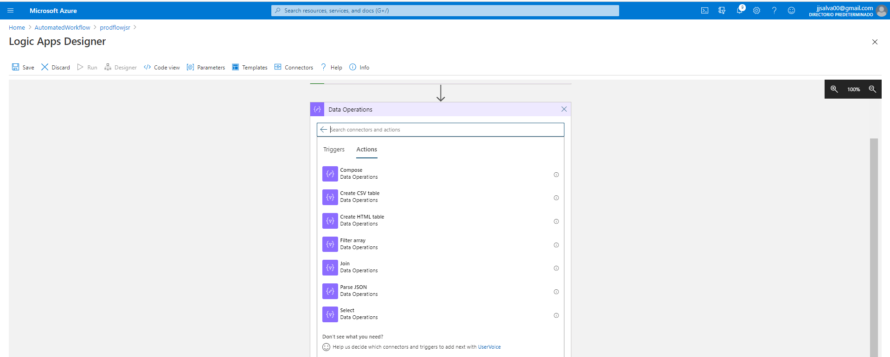

   1. In the **Search connectors and triggers** field, enter **select**.

   1. In the category list, select **Data Operations**.

   1. In the **Actions** result list, select **Select**.

      

1. In the **Select** area, perform the following actions to configure the **Select (Data Operations)** action:

   1. In the **From** field, in the **Dynamic content** list, within the **List files** category, select **value**. 

   1. In the **Map** field, select **Switch to text mode**.

   1. In the **Map** field, in the **Dynamic content** list, within the **List files** category, select **Name**.

      

#### Task 4: Build an HTTP response action

1. In the **Designer** area, select **+ New step**, and then perform the following actions to add a **Response (Request)** action:

   1.  In the **Search connectors and triggers** field, enter **response**.

   1.  In the **Actions** result list, select **Response**.

1. In the **Response** area, perform the following actions to configure the **Response (Request)** action:

   1.  In the **Status Code** text box, enter **200**.

   1.  On the **Body** field, in the **Dynamic content** list, within the **Select** category, select **Output**.

1. In the **Designer** area, select **Save**.

   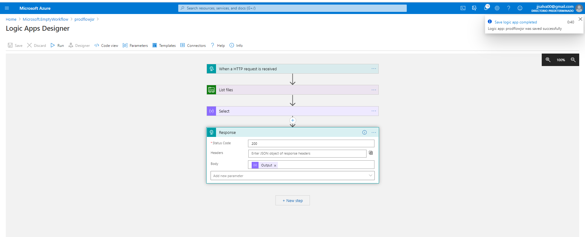

#### Review

In this exercise, you built a basic workflow that starts when it's triggered by an HTTP GET request. It then queries a storage service, enumerates the results, and then returns those results as an HTTP response.

### Exercise 3: Use Azure API Management as a proxy for Logic Apps

#### Task 1: Create an API integrated with Logic Apps

1. In the Azure portal navigation pane, select **Resource groups**.

1. On the **Resource groups** blade, select the **AutomatedWorkflow** resource group that you created earlier in this lab.

1. On the **AutomatedWorkflow** blade, select the **prodapim*[yourname]*** API Management resource that you created earlier in this lab.

1. From the **API Management Service** blade, in the **API Management** section, select **APIs**.

   

1. In the **Add a new API** section, select **Logic App**.

1. In the **Create from Logic App** dialog box, perform the following actions:

   1.  Select **Full**.

   1.  In the **Logic App** section, select **Browse**. 

   1.  In the **Select Logic App to import** dialog box, select the **prodflow*[yourname]*** Logic App that you created earlier in this lab, and then select **Select**.

   1.  In the **Display name** text box, enter **Metadata Lookup**.

   1.  In the **Name** text box, enter **metadata-lookup**.

   1.  Leave the **API URL suffix** text box empty.

   1.  Select **Create**. 

   > **Note**: Wait for the new API to finish being created.


#### Task 2: Test the API operation

1.  From the **Design** tab, select **Test**.

1.  On the **Test** tab, perform the following actions:

    1.  Select the single **GET** operation.

    1.  Copy the value of the **Request URL** field. (You will use this value later in the lab.)

    1.  Select **Send**.

    1.  In the **HTTP response** section, observe the JSON results of the test request.

1.  Return to your browser window with the Azure portal.


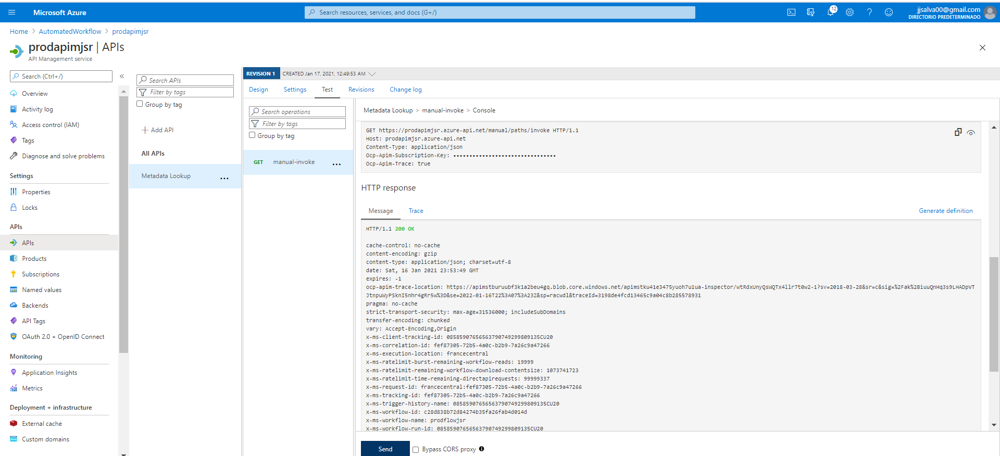

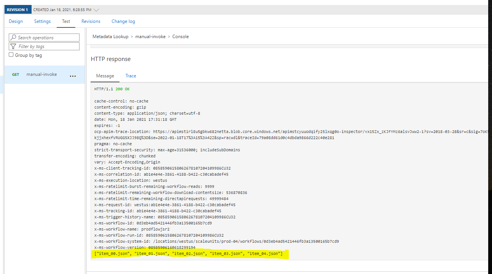

#### Review

In this exercise, you used Azure API Management as a proxy to trigger your Logic App workflow.

### Exercise 4: Clean up your subscription 

#### Task 2: Delete resource groups

1. Enter the following command, and then select Enter to delete the **AutomatedWorkflow** resource group:

   ```
   az group delete --name AutomatedWorkflow --no-wait --yes
   ```

   
