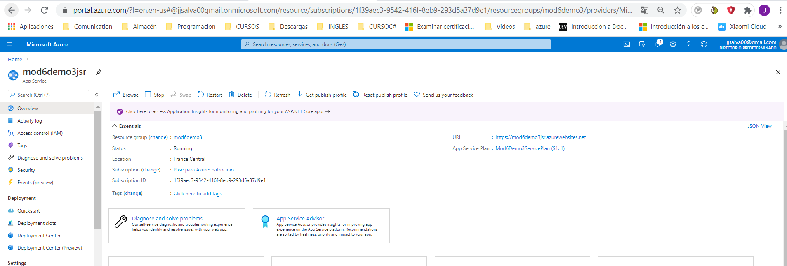
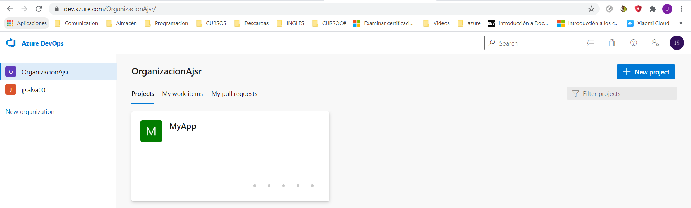
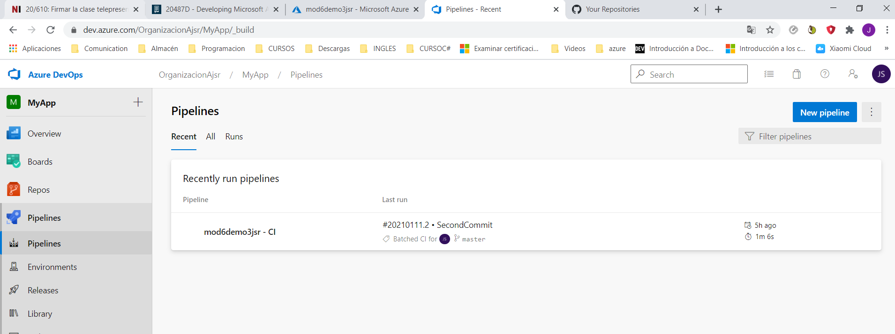
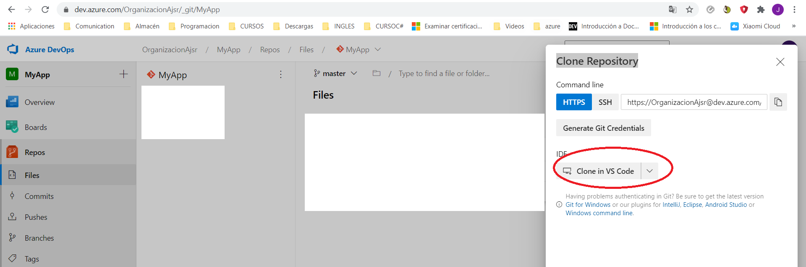
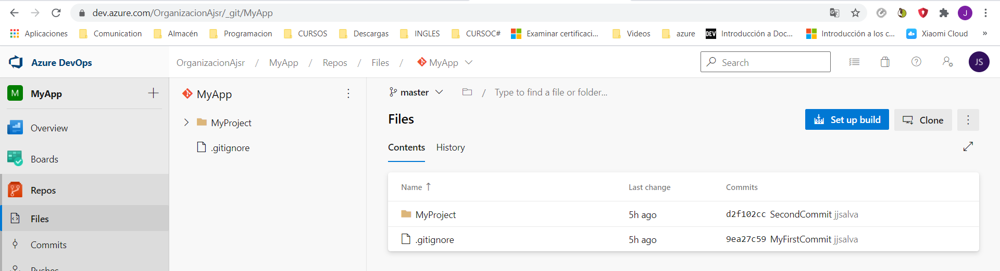
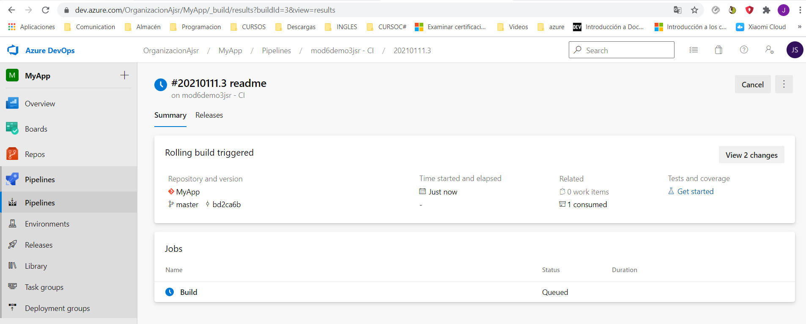
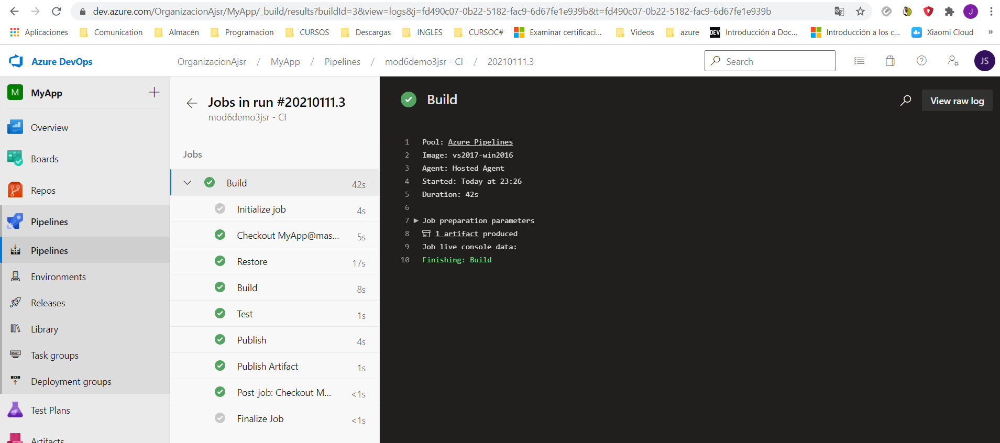
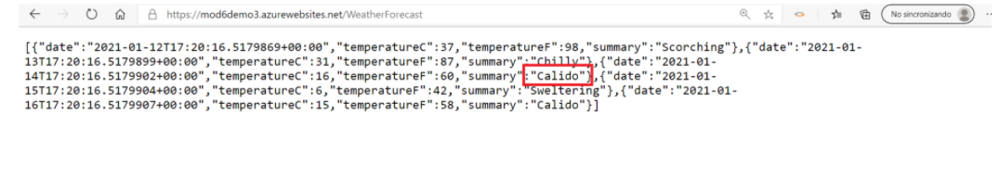

## MOD6_L3

# ### Continuous Delivery to Websites with Git and Visual Studio Team Services

**Creamos App Services desde azure**

**Entramos en Devops ** 

Creamos el proyecto MyApp

**Creamos Pipeline**

**Clonamos el Serice App en Visual Code**

- Abrimos con Visual Code

- Aceptamos

- Seleecionamos la carpeta donde clonaremos el proyecto.

  E:\JUANJO\CURSO2020\MODULO4_AZURE\20487D\AllFiles\Mod06\DemoFiles\MyApp

- En el visual code ponemos el fichero .gitignore y añadimos el obj y el bin

  **Publicamos**

  Una vez en el code hacemos commit y lo subimos, o lo hacemos por linea de comando. Esto lo desplegará en el propio devops.

  - git add .

  - git commit -m "my first commit"

  - git push

  

   Ir a azure portal

    en el web app deployment center:

    \- Azure Repos
      \- Continue
      \- Azure Pipelines (Preview) Continue
      \- Azure DevOps Organization->OrganizationA
      \- Project->MyApp
      \- Repository->MyApp
      \- Branch->Master ->Continue ->Finish

  

**Ir a los pipelines**

Cuando hacemos push en el Visual Code se publica en el Pipelibe. 

**Cuando acaba**

**Una vez publicado podemos verlo en la web**

