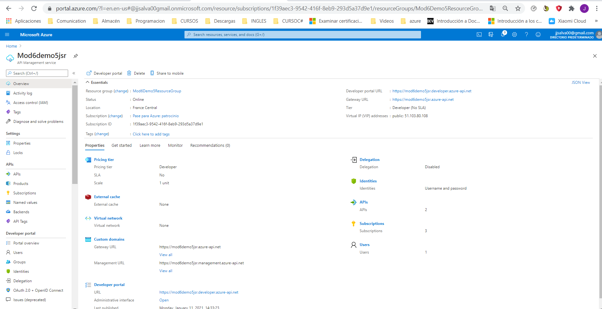
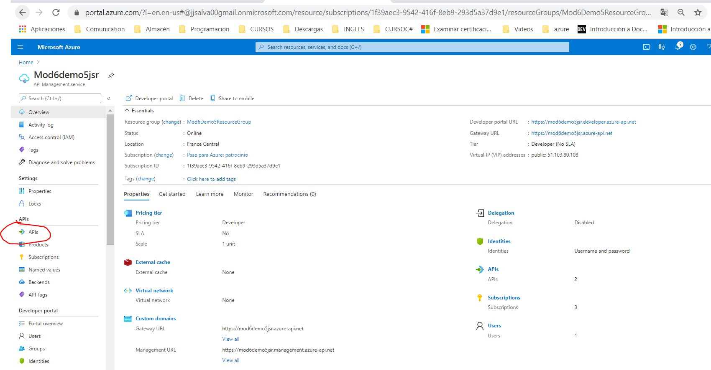
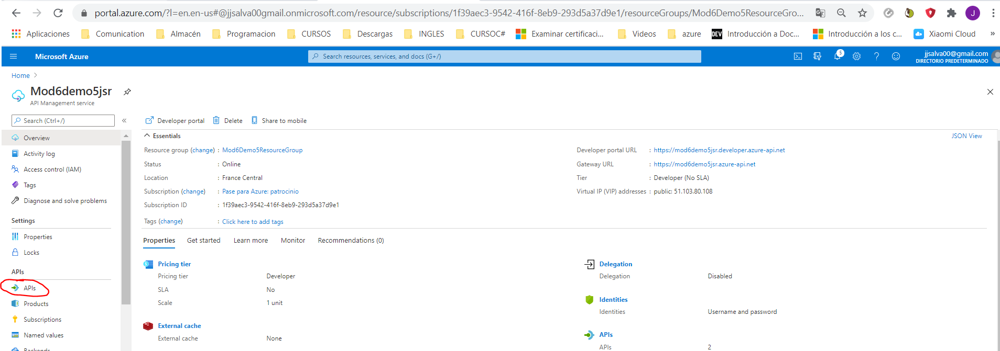
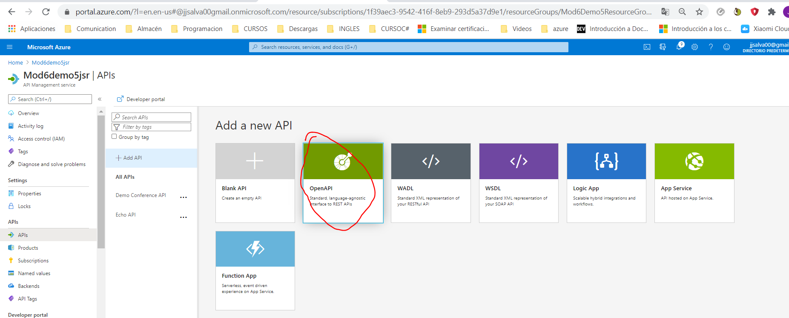
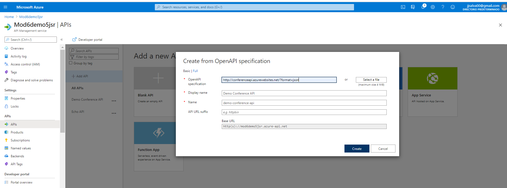
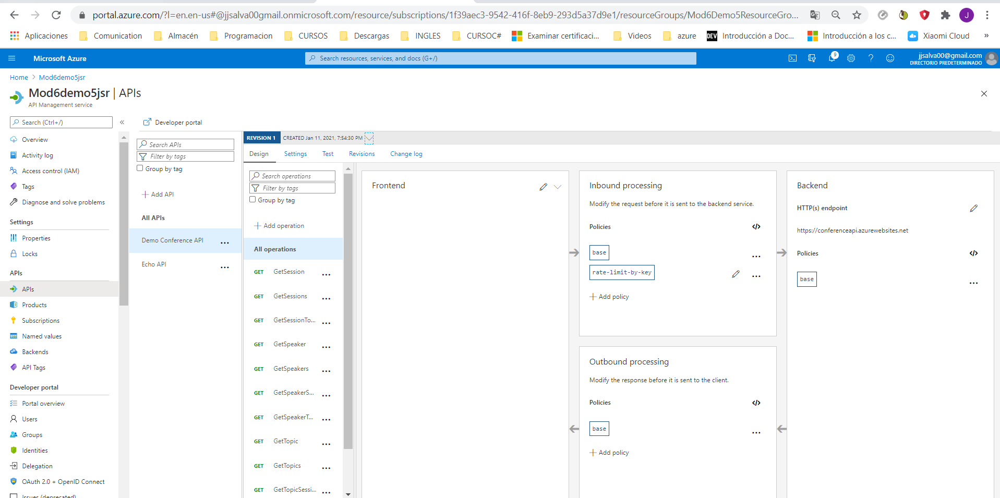
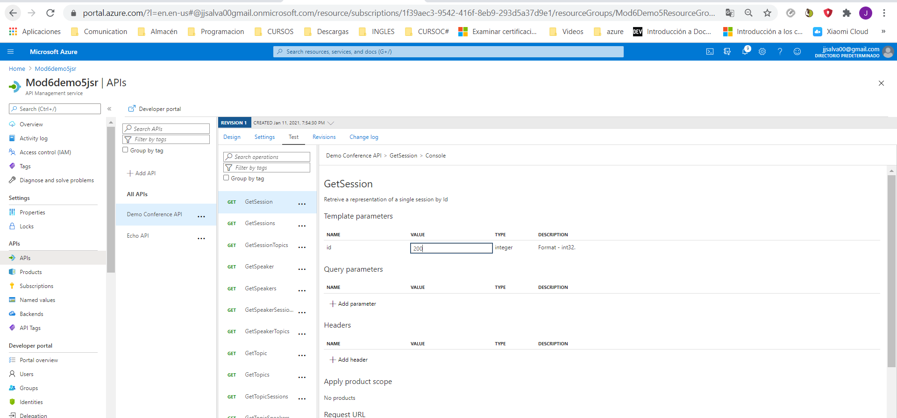
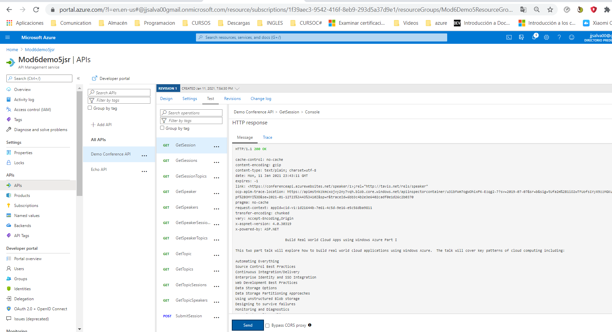

## DEMO6_L5

## Defining Service Interfaces with Azure API Management

**Creamos el API Management**

**Seleccionamos API:**

**Seleccionamos APIs**

**Seleccionamos Open API**

**Definimos un API ya creado**

**Podemos ver el panel de Gestion**

- A la derecha todas los métodos.

**Probamos**

Selecionamos el método GetSession con valor 200 y luego con 100 y vemos que devuelve 200.

