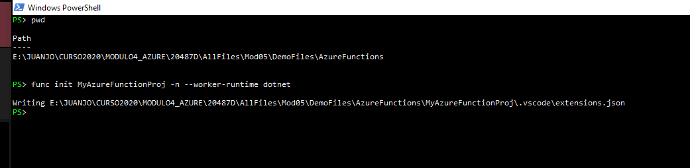
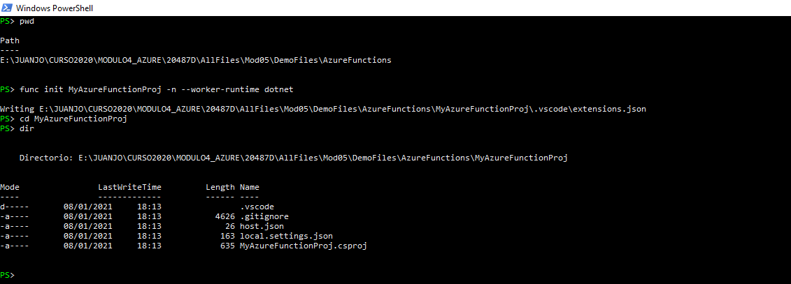
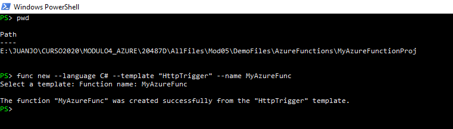
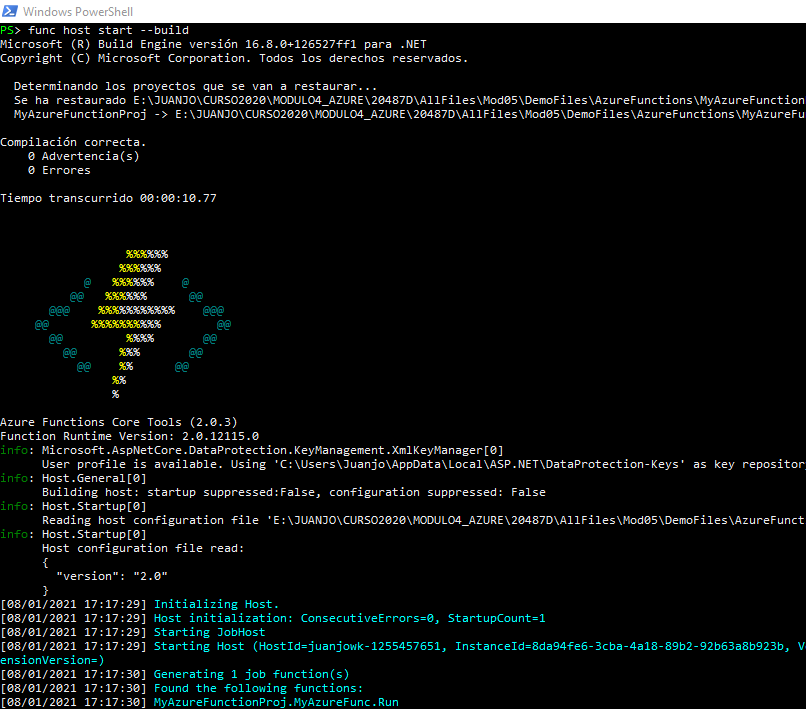
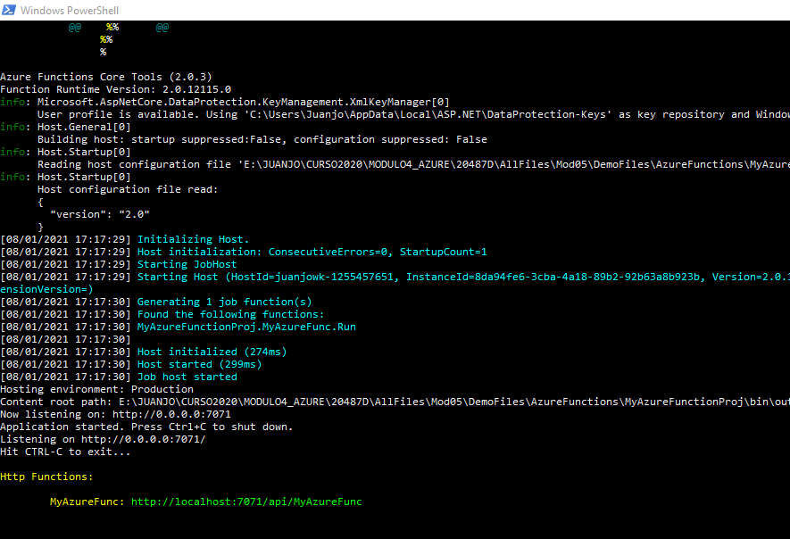
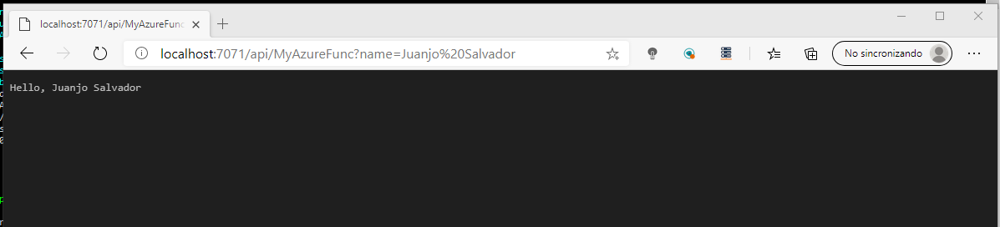
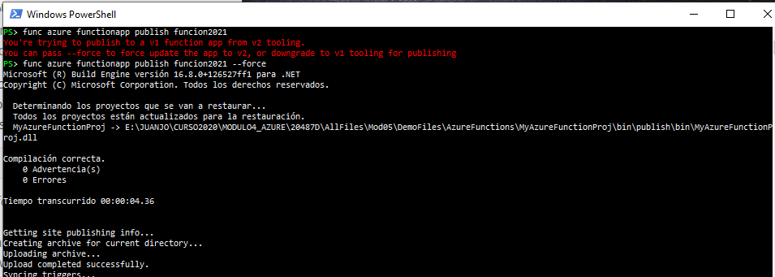
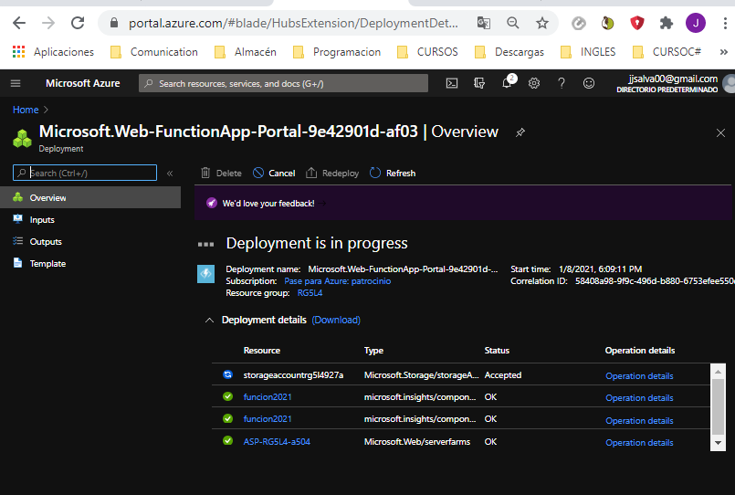
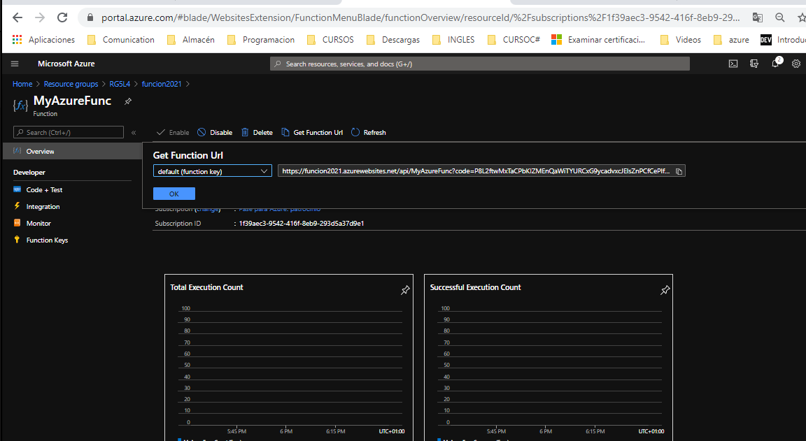
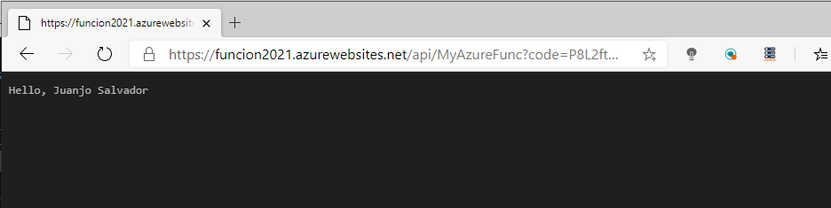

##DEMO5_L4_2

###Developing, Testing, and Publishing an Azure Function from CLI

**Creamos la funcion por comandos en el proyecto local**

**Creamos disparador  en el proyecto local**

**Testeamos**

**Probamos el resultado**

**Publicamos en Azure**

 

**Comprobamos que se ha creado**

**Cogemos la URL**

**Probamos**

