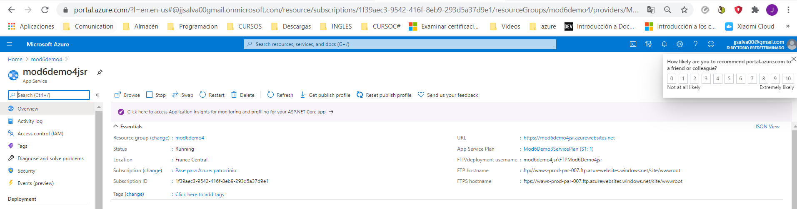
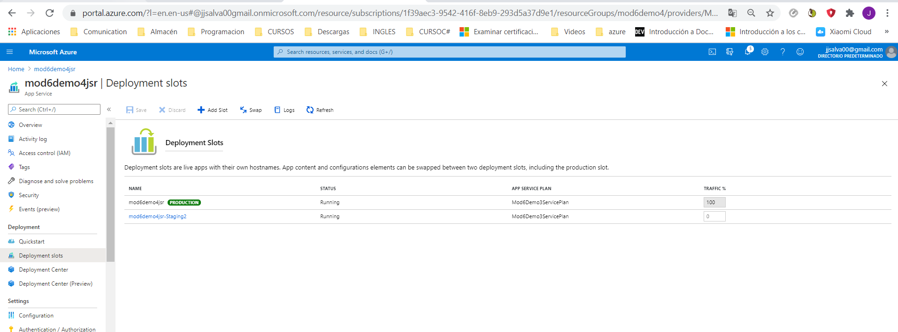
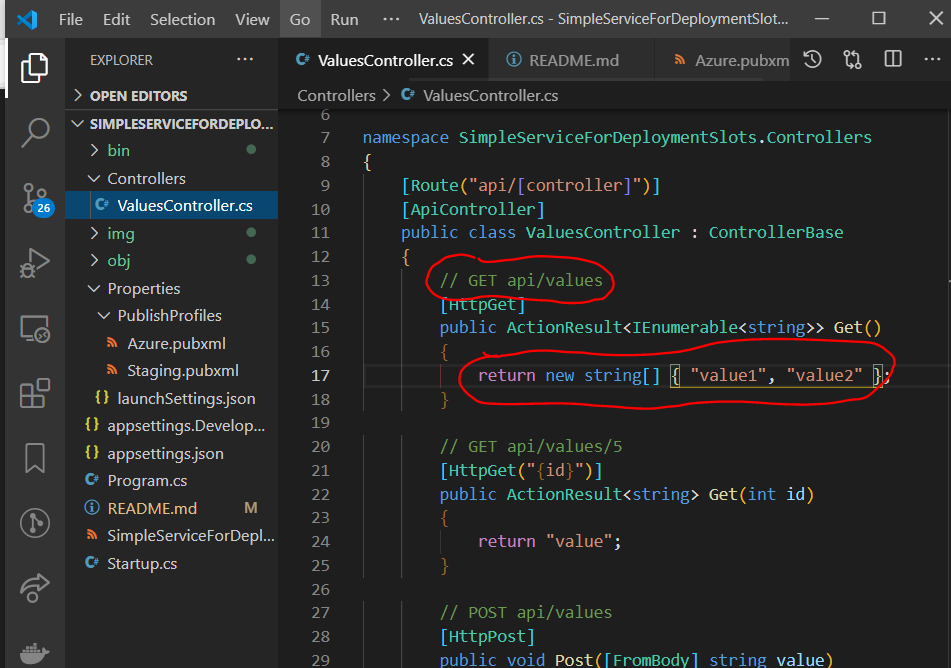
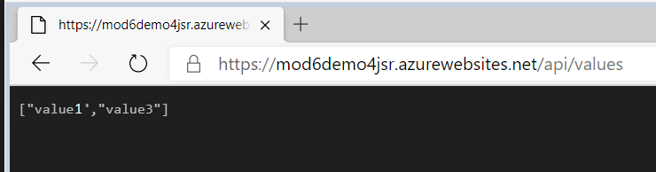
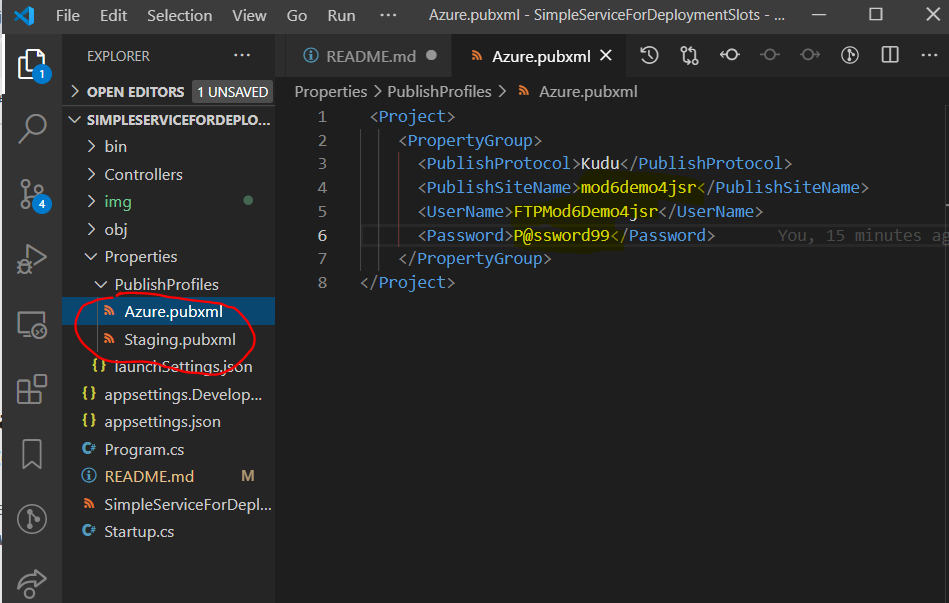
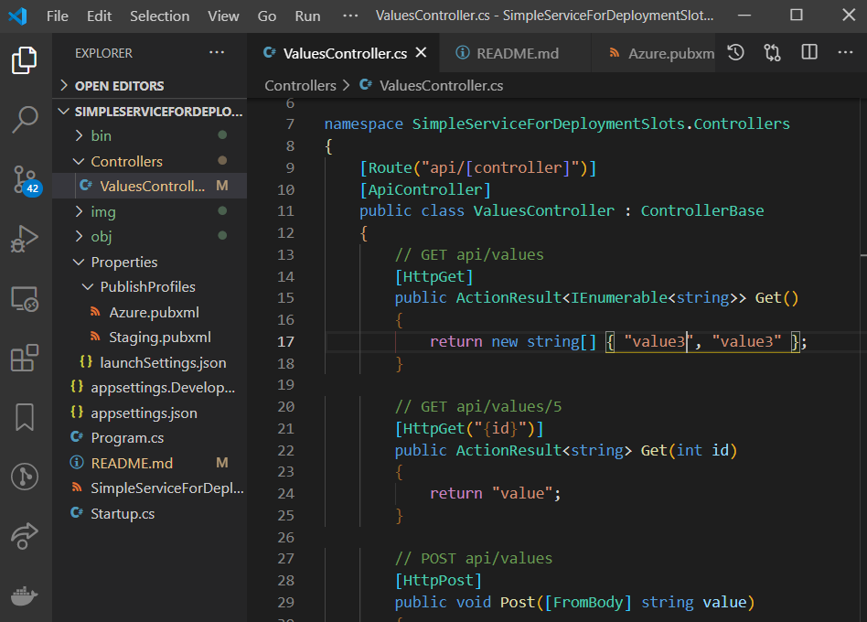
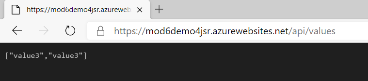
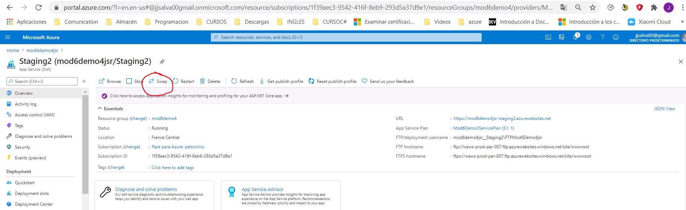
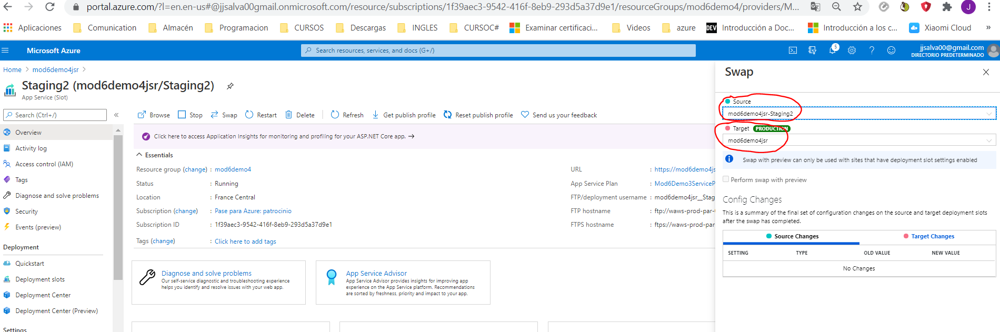

## MOD6_L4
## Deploying to Staging and Production Environments

Con los Slot conseguimos desplgar entre varios entornos. Lo que hace es camabiar el código de uno en otro, y de ese otro en el primero.
Con lo cual, lso cambios de Staging suben a Prod y los de Prod bajan a Staging. Si queremos conservar el origina en ambos habrña que tener varios slot.

**Portal Azure**
Creamos el App Service.

**Deployment center**

Seleccionamos despligue manual Ftp

**Slot**
Creamos un Slot con nombre Staging.
Se crea un despliegue para Staging y queda el de produccion. Ahora podemos desplegar de Saging a Prod y viceversa

**Para la prueba ejecutamos el app service original**7

**publicamos**
Para el despiegue es necesario que en el proyecto, en la carpeta de propiedades exita las propiedades para el despliegue Azure y el Staging

Luego cambiamos el código para ver el cambio 

publicamos y vemos el resultado 

**Swap**

Con el Swap hacemos sel intercambio de Staging a Prod y de Prdo a Staging.

