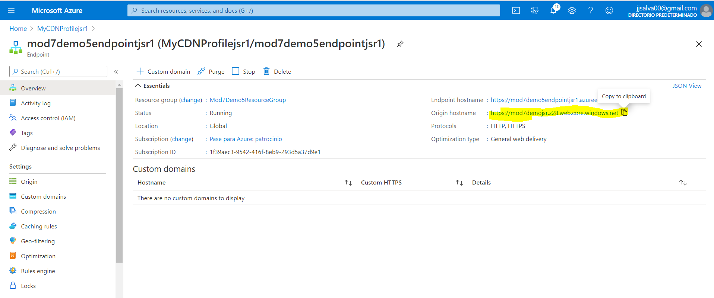

##DEMO7_L4

### Configuring a CDN Endpoint for a Static Website

**Lo primero es ir a Azure y activar DNS.**

**Segundo, creamos una Storage accounts**.

1. **Habilitamos el Static Web Site y guardamos**

   

   

2. Click the **$web** container 

   

3. Subimos nuestro fichero de prueba **Upload**.

   

4. Volvemos al mod7demo5jsr y ponemos como Index document name: index.html para que abra ese por defecto

   

5. Seleccionamos el pimary endpoint y lo abrinos en un browser.

   

   6. Definimos el CDN

   

   

7. Creado el CDN

8. Click **Endpoint hostname** y abrimos la url

Abrimos en web:

Press F12, and then click the **Network** tab.

In **URL**, type **/airplane1.jpg**, and then press Enter.

In the **Network** tab, click **airplane1.jpg** and in **Response Headers**, verify that **x-cache: HIT** is not present.

Refresh the page five times.

In **Response Headers**, verify that **x-cache: HIT** is present.

