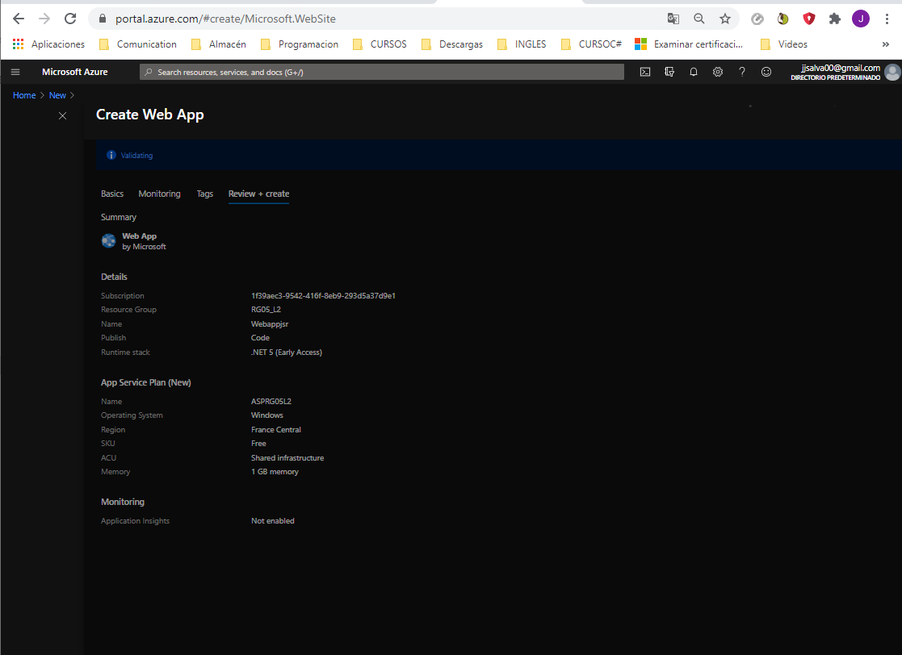
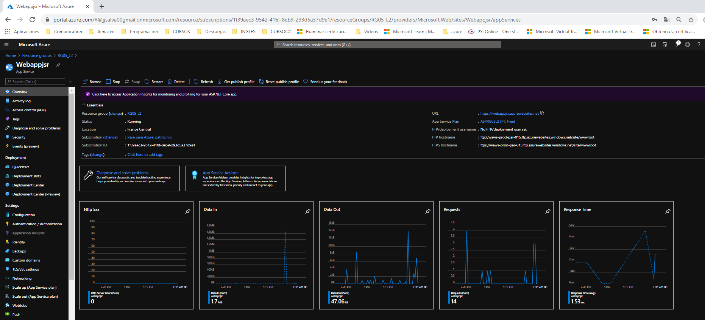
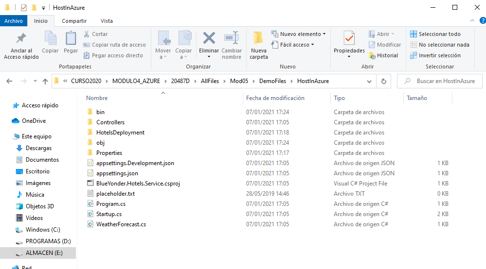
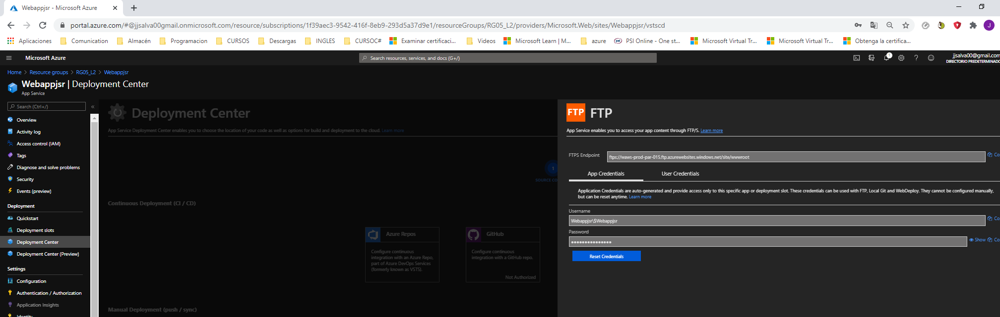
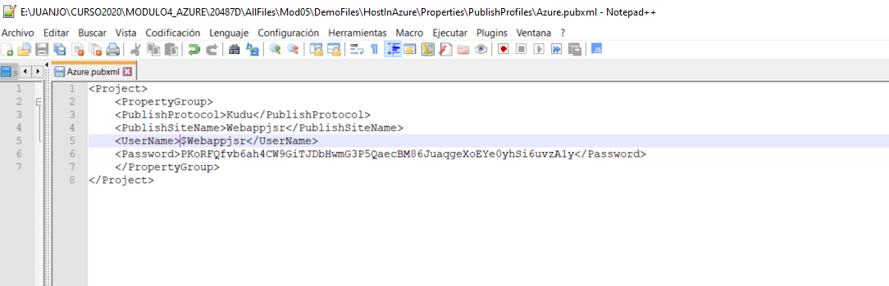
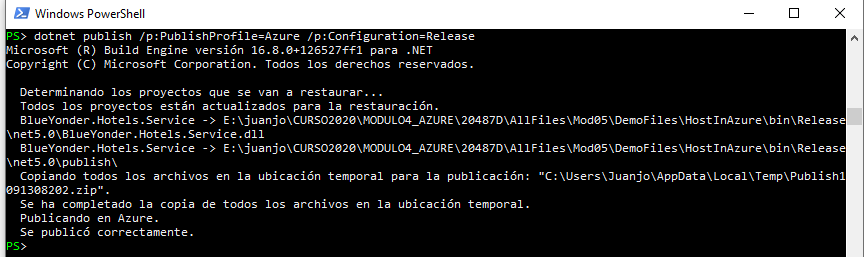
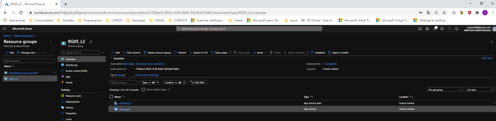
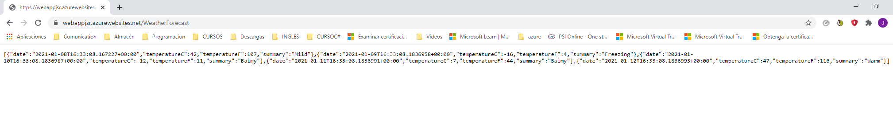
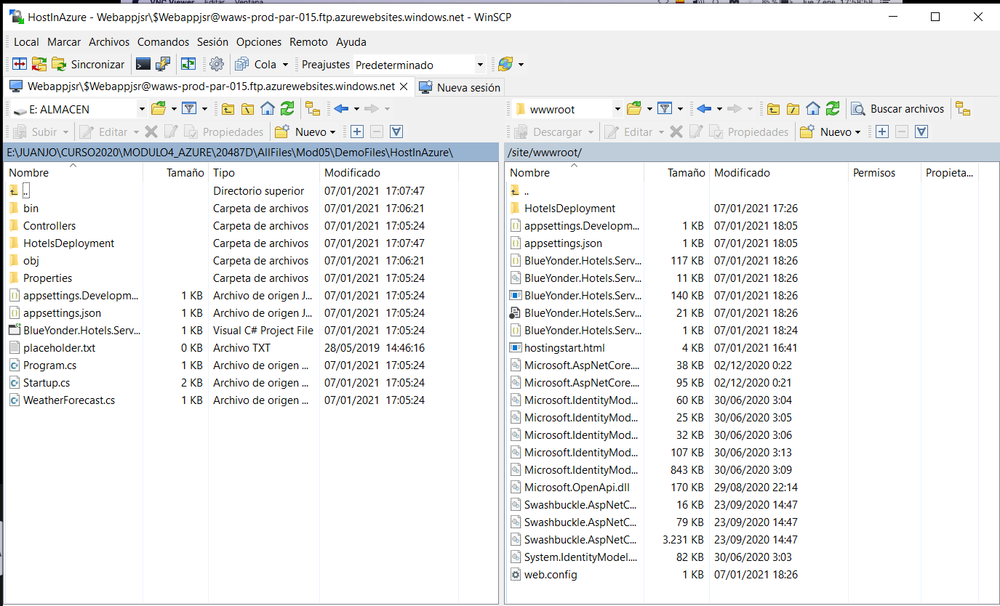

# Hosting-Services-in-Web-Apps-Feature-of-Azure-App-Service
#DEMO5_L2

##Hosting Services in Web Apps Feature of Azure App Service

**Creamos el Web App**

**Hemos creado el proyecto:**

**Resultado en local**

**Creamos sitio ftp**

**Creamos el fichero Azure.pubxml**

**Publicamos el proyecto**

**Resultado:**

**Se puede ver en el ftp**

