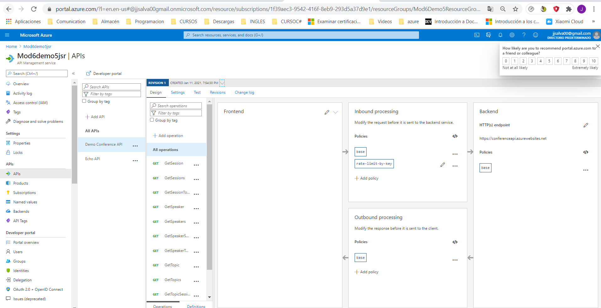
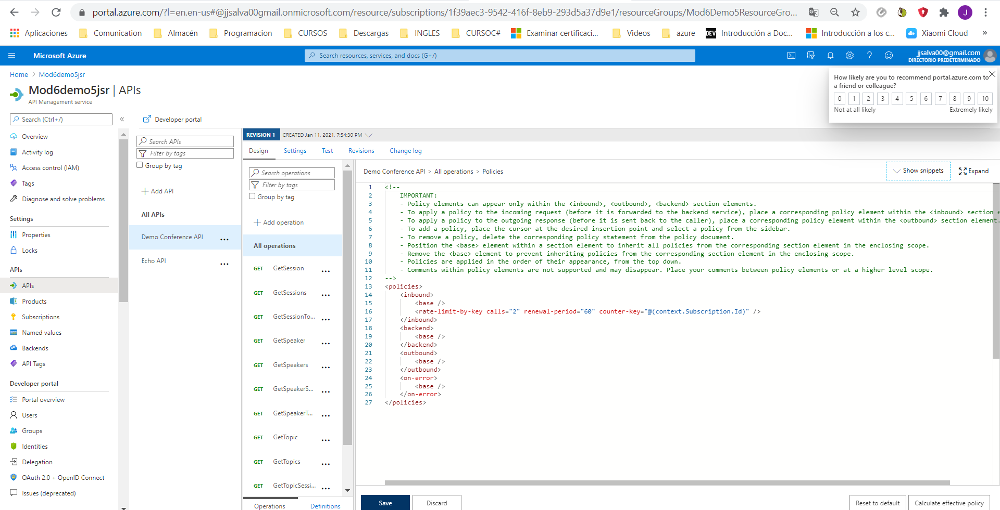
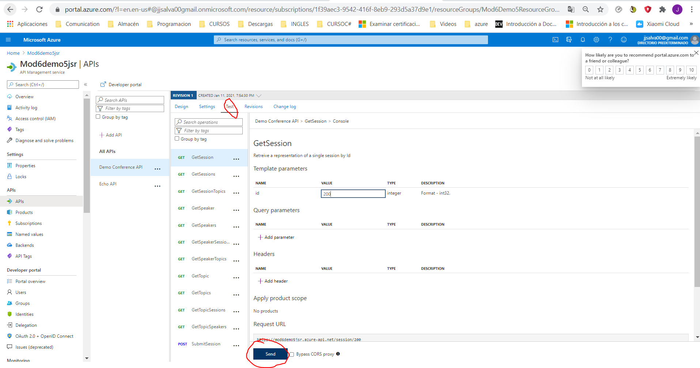

## DEMO6_L6

## Limiting Call Rates Using API Management

Dentro del API Managment

Seleccionamos nuestra APIS

Seleccionamos todas las operaciones

En el panel de Inbound processing pinchamos en el simbolod e xml e insertamos este código:

Hemos creado una politíca a todos los métodos de manera que a la tercera vez que se envíe un método saltará el error.

Una vez:

Dos veces:

Tres veces:

