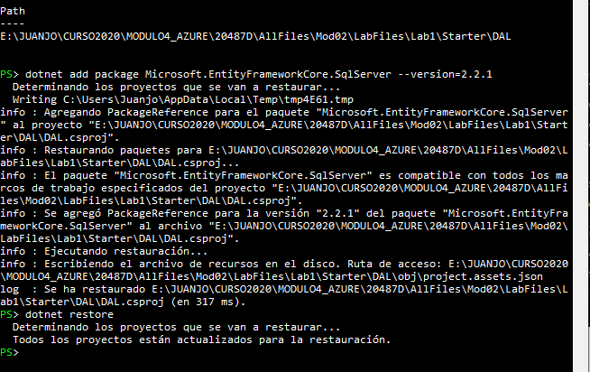
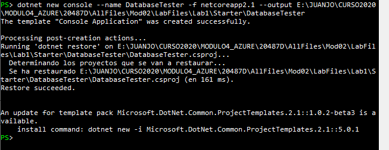
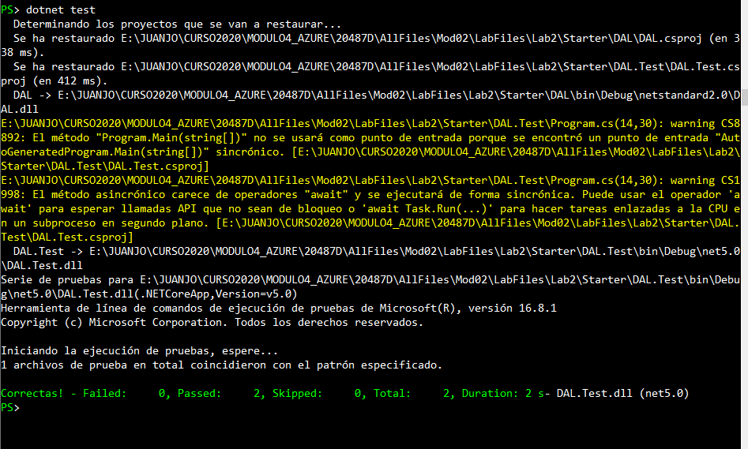
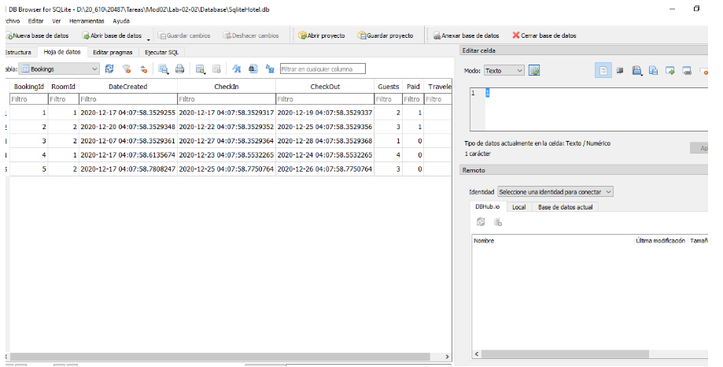

## Laboratorio Módulo 2 (Tiene 2 LABs)

Fichero de Instrucciones: Instructions\20487D_MOD02_LAK.md

Entregar el url de GitHub con la solución y un readme con las siguiente información:

1. **Nombres y apellidos:** Juan José Salvador Román

2. **Fecha:** 22/12/2020

3. **Resumen del Ejercicio:** 

   **Querying and Manipulating Data Using Entity Framework**

   **Lab: Creating a Data Access Layer using Entity Framework**

   

   **Exercise 1: Creating a Data Model**

   Creamos una nueva  ASP.NET Core Class Library

   <pre><code>
     dotnet new classlib --name DAL -f netcoreapp2.1 --output E:\JUANJO\CURSO2020\MODULO4_AZURE\20487D\AllFiles\Mod02\LabFiles\Lab1\Starter\DAL  
   </code></pre>
   
   
   
   

Instalamos el paquete de EntityFramework

   <pre><code>
       dotnet add package Microsoft.EntityFrameworkCore.SqlServer --version=2.2.1
    dotnet restore
</code></pre>
   

   Abrimos el código y :

   implementamos el modelo con las clases: Traveler, Room, Hotel y Booking

   

   Creamos la clase Contexto de la base de datos.

   

   **Exercise 2: Query your database**

   Creamos un nuevo ASP.NET Core Console Application

   <pre><code>
     dotnet new console --name DatabaseTester -f netcoreapp2.1 --output E:\JUANJO\CURSO2020\MODULO4_AZURE\20487D\AllFiles\Mod02\LabFiles\Lab1\Starter\DatabaseTester
   </code></pre>

   

Para crear una nueva solución en los proyectos DAL  y DatabaseTester, ejecutamos el siguiente comando: 

<pre><code>
    dotnet new sln --name Mod2Lab1  
   </code></pre>
   Añadimos el proyecto DAL a la solución

   <pre><code>
dotnet sln Mod2Lab1.sln add DAL\DAL.csproj
   </code></pre>
   Añadir el proyecto DatabaseTester a la solución

<pre><code>
       dotnet sln Mod2Lab1.sln add DatabaseTester\DatabaseTester.csproj
   </code></pre>
   

   Añadimos al proyecto la referencia de DAL

        <pre><code>
        <ItemGroup>
        	<ProjectReference Include="..\DAL\DAL.csproj" />
        </ItemGroup>
        </code></pre>

   Cargamos los datos en el DbInitializer.cs

   

   Ejecutamos y se crean los datos:

   

   ### Lab: Manipulating Data

   **Exercise 1: Create repository methods**

   Creamos un método para añadir tablas, otro para actualizar tablas y otro para borrar tablas.

   **Exercise 2: Test the model using SQL Server and SQLite**

Creamos un nuevo proyecto de Unit test

<pre><code>
    dotnet new mstest --name DAL.Test -f netcoreapp2.1

</code></pre>

Añadimos el proyecto DAL.test  a la solución

<pre><code>
     dotnet sln Mod2Lab2.sln add DAL.Test\DAL.Test.csproj
</code></pre>

Añadimos la referencia al proyecto DAL 

    <pre><code>
    <ItemGroup>
     <ProjectReference Include="..\DAL\DAL.csproj" />
    </ItemGroup>
    </code></pre>

implementamos el método de Test: AddTwoBookingsTest.

Ejecutamos el sets

<pre><code>
    dotnet test
</code></pre>

**Abrimos Azure Data Studio. **

Elegimos \SQLEXPRESS y conectamos

Cogemos el servidor .\sqlexpress y expandimos databases y seleccionamos Mod2Lab2DB. Expandimos las tablas, pinchamos en la dbo.Bookings y hacemos un Select Top 100 rows

**Task 3: Replace the SQL Server provider with SQLite**

Vamos al directorio **DAL.Test**.

ejecutamos:

<pre><code>dotnet add package Microsoft.EntityFrameworkCore.Sqlite --version=2.2.1

<pre><code>dotnet restore</code><code></pre>

abrimos el Visual code y hacemos el cambio.

Hacemos de nuevo el Test en SqlLite

Abrimos el  **DB Browser for SQLite**

1. **Dificultad o problemas presentados y como se resolvieron:**

