# Module 09: Securing services on-premises and in Microsoft Azure

# Lab: Using ASP.NET Core Identity

1. Wherever a path to a file starts with *[Repository Root]*, replace it with the absolute path to the folder in which the 20487 repository resides.
   For example, if you cloned or extracted the 20487 repository to **C:\Users\John Doe\Downloads\20487**, change the path: *[Repository Root]***\AllFiles\20487D\Mod01** to **C:\Users\John Doe\Downloads\20487\AllFiles\20487D\Mod01**.
2. Wherever *[YourInitials]* appears, replace it with your actual initials. (For example, the initials for **John Doe** will be **jd**.)
3. Before performing the demonstration, you should allow some time for the provisioning of the different Microsoft Azure resources required for the demonstration. You should review the demonstrations before the actual class, identify the resources, and prepare them beforehand to save classroom time.

### Exercise 1: Add ASP.NET Core Identity middleware

#### Task 1: Add ASP.NET Core Identity NuGet

1. Open the command prompt.

2. To change the directory to the **Starter** project, run the following command:

   ```bash
   cd [Repository Root]\Allfiles\Mod09\LabFiles\Lab1\Starter
   ```

3. To create a new **ASP.NET Core** project, at the command prompt, paste the following command, and then press Enter:

   ```bash
    dotnet new webapi --name Identity -f netcoreapp2.1
   ```

   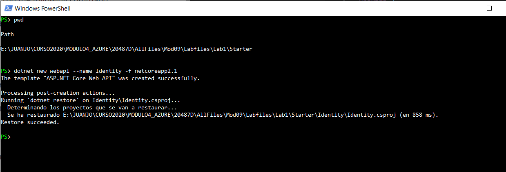

4. To change the directory to the **Identity** project, run the following command:

   ```bash
   cd Identity
   ```

5. To use **Entity Framework Core**, from the command prompt, install the following package:

   ```base
    dotnet add package Microsoft.EntityFrameworkCore.Sqlite --version 2.1.4
    dotnet restore
   ```

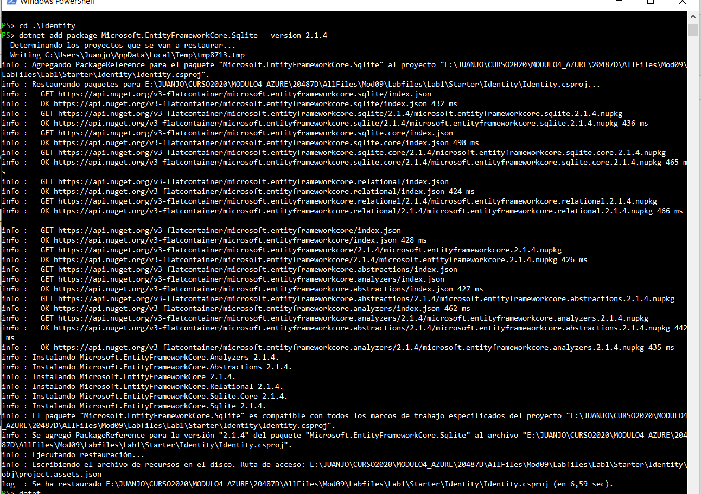


#### Task 2: Create a new DbInitializer with seed for users and groups

1. To open the project in Microsoft Visual Studio Code, run the following command: 

   ```bash
   code .
   ```

2. In the **EXPLORER** panel, right-click the **Identity** area, select **New Folder**, and then name it **Data**.

3. To create a new **ApplicationDbContext** class, right-click **Data** folder, select **New File**, and then name it **ApplicationDbContext.cs**

4. To the **ApplicationDbContext** class, add the following **using** statements:

   ```cs
       using Microsoft.AspNetCore.Identity.EntityFrameworkCore;
       using Microsoft.EntityFrameworkCore;
   ```

5. To add a namespace to the class, enter the following code:

   ```cs
       namespace Identity.Data
       {
       
       }
   ```

6. To add a class declaration, inside the **namespace** brackets, enter the following code:

   ```cs
       public class ApplicationDbContext : IdentityDbContext
       {
   
       }
   ```

7. To add a constructor to the class, inside the **class** brackets, enter the following code:

   ```cs
       public ApplicationDbContext(DbContextOptions<ApplicationDbContext> option) 
           : base(option)
       {
           DbInitializer.Initialize(this);
       }
   ```

   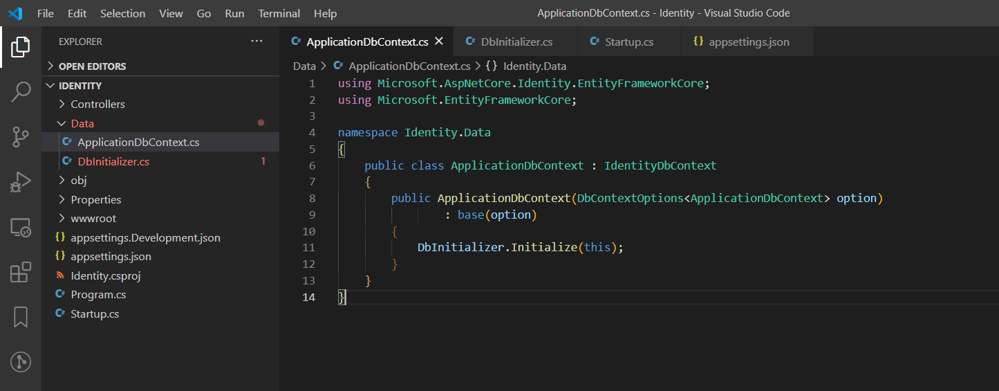

8. To create the **DbInitializer** class, right-click the **Data** folder, select **New File**, and then name it **DbInitializer.cs**

9. In the **DbInitializer** class, add the following **using** statements:

   ```cs
       using Microsoft.AspNetCore.Identity;
       using System;
       using System.Collections.Generic;
       using System.Text;
   ```

10. To add a namespace to the class, enter the following code:

    ```cs
        namespace Identity.Data
        {
    
        }
    ```

11. To add a class declaration, inside the **namespace** brackets, enter the following code:

    ```cs
        public static class DbInitializer
        {
    
        }
    ```

12. To add the **Initialize** method to the **class** brackets, enter the following code:

    ```cs
        public static void Initialize(ApplicationDbContext context)
        {
            if (context.Database.EnsureCreated())
            {
                // Code to create initial data
                Seed(context);
            }
        }
    ```

13. To add the **Seed** method to the **class** brackets, enter the following code:

    ```cs
        private static void Seed(ApplicationDbContext context)
        {
            // Create list with dummy users 
            List<IdentityUser> userList = new List<IdentityUser>
            {
                new IdentityUser("JonDue") { Email = "jond@outlook.com", PasswordHash = Convert.ToBase64String(Encoding.ASCII.GetBytes("password1234"))},
            };
            context.Users.AddRange(userList);
            context.SaveChanges();
        }
    ```

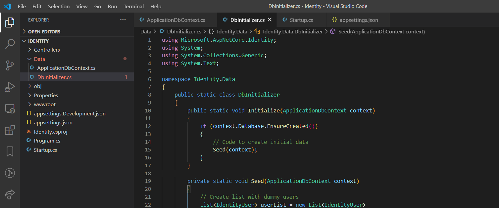

#### Task 3: Register ASP.NET Core Identity in the startup file

1. Open the **Startup.cs** file.

2. At the top of the page, add the following **using**statements:

   ```cs
       using Identity.Data;
       using Microsoft.EntityFrameworkCore;
       using Microsoft.AspNetCore.Identity;
       using Microsoft.AspNetCore.Authentication.JwtBearer;
       using Microsoft.IdentityModel.Tokens;
       using System.Text;
   ```

3. Inside the **ConfigureServices** method, before the line starting with **services.AddMvc() ...**, add the following code:

   ```cs
       services.AddDbContext<ApplicationDbContext>(options =>
           options.UseSqlite(
               Configuration.GetConnectionString("DefaultConnection")));
       services.AddDefaultIdentity<IdentityUser>()
           .AddEntityFrameworkStores<ApplicationDbContext>()
           .AddSignInManager()
           .AddDefaultTokenProviders();
   
       services.AddAuthentication(options =>
       {
           options.DefaultAuthenticateScheme = JwtBearerDefaults.AuthenticationScheme;
           options.DefaultScheme = JwtBearerDefaults.AuthenticationScheme;
           options.DefaultChallengeScheme = JwtBearerDefaults.AuthenticationScheme;
   
       })
       .AddJwtBearer(cfg =>
       {
           cfg.RequireHttpsMetadata = false;
           cfg.SaveToken = true;
           cfg.TokenValidationParameters = new TokenValidationParameters
           {
               ValidIssuer = Configuration["JwtIssuer"],
               ValidAudience = Configuration["JwtIssuer"],
               IssuerSigningKey = new SymmetricSecurityKey(Encoding.UTF8.GetBytes(Configuration["JwtKey"])),
               ClockSkew = TimeSpan.Zero // remove delay of token when expire
           };
       });
   ```

4. Locate the **Configure** method and before the **app.UseHttpsRedirection();** call, add the following code:

   ```cs
       app.UseAuthentication();
   ```

   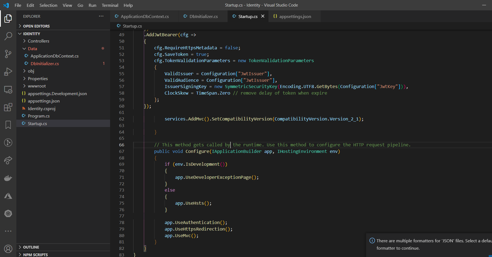

5. Open the **appsettings.json** file.

6. To add the connection string and the JWT configuration, paste the following code inside the brackets:

   ```json
    "ConnectionStrings": {
    "DefaultConnection": "DataSource=app.db"
    },
    "JwtKey": "1234567891011121314151617181920",
    "JwtIssuer": "http://localhost.com",
    "JwtExpireDays": 30,
   ```

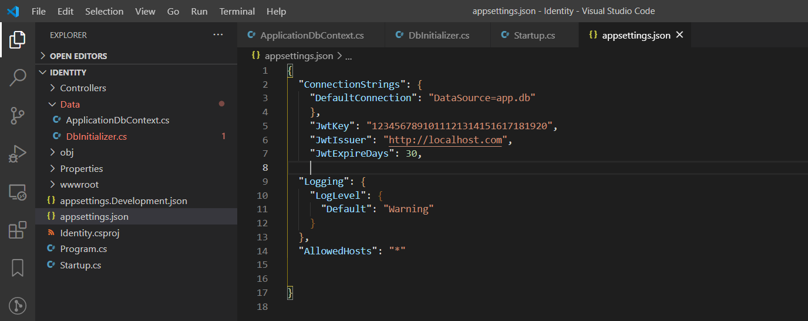

### Exercise 2: Add authorization code

#### Task 1: Add user controller

1. In the **EXPLORER** panel, right-click the **Identity** area, select **New Folder**, and then name it **Models**.

2. To create a new **LoginDto** class, right-click the **Models** folder, select **New File**, and then name it **LoginDto.cs**

3. In the **LoginDto** class, add the following **using** statement:

   ```cs
       using System.ComponentModel.DataAnnotations;
   ```

4. To add a namespace to the class, enter the following code:

   ```cs
       namespace Identity.Models
       {
   
       }
   ```

5. To add a class declaration, inside the **namespace** brackets, enter the following code:

   ```cs
       public class LoginDto
       {
   
       }
   ```

6. In the **LoginDto** class, add the following properties:

   ```cs
       [Required]
       public string Username { get; set; }
   
       [Required]
       public string Password { get; set; }
   ```

   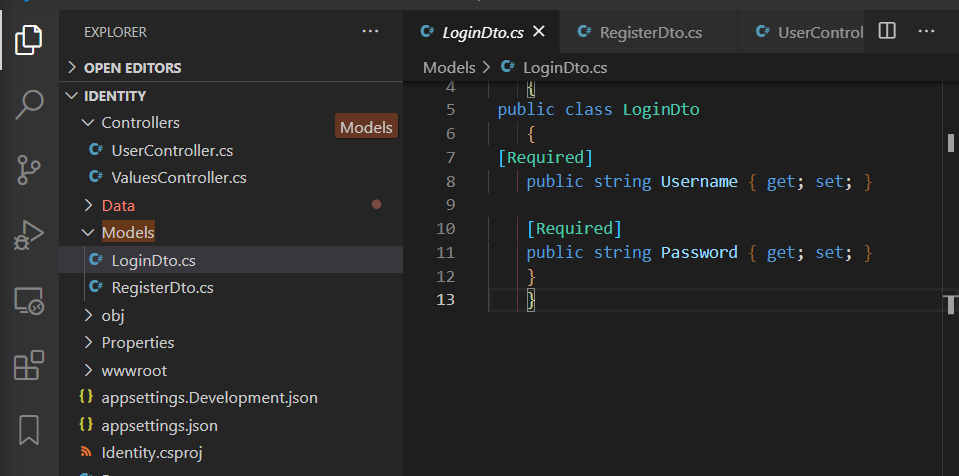

7. To create a new **RegisterDto** class, right-click the **Models** folder, select **New File**, and then name it **RegisterDto.cs**

8. To the **RegisterDto** class, add the following **using** statement:

   ```cs
       using System.ComponentModel.DataAnnotations;
   ```

9. To add a namespace to the class, enter the following code:

   ```cs
       namespace Identity.Models
       {
   
       }
   ```

10. To add a class declaration, inside the **namespace** brackets, enter the following code:

    ```cs
        public class RegisterDto
        {
    
        }
    ```

11. In the **RegisterDto** class, add the following properties:

    ```cs
        [Required]
        public string Username { get; set; }
    
        [Required]
        [StringLength(100, ErrorMessage = "PASSWORD_MIN_LENGTH", MinimumLength = 6)]
        public string Password { get; set; }
    ```

    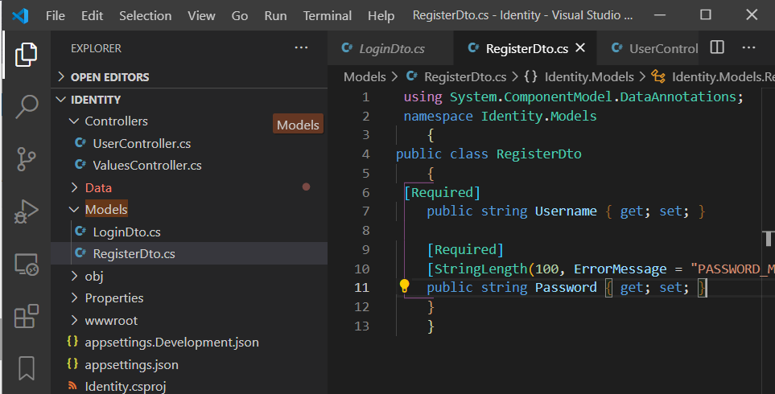

12. To create a new **UserController** class, right-click  **Controllers**, select **New File**, and then enter **UserController.cs**.

13. To the **UserController** class, add the following **using** statements:

    ```cs
        using System;
        using System.IdentityModel.Tokens.Jwt;
        using System.Linq;
        using System.Security.Claims;
        using System.Text;
        using System.Threading.Tasks;
        using Microsoft.AspNetCore.Identity;
        using Microsoft.AspNetCore.Mvc;
        using Microsoft.Extensions.Configuration;
        using Microsoft.IdentityModel.Tokens;
        using Identity.Models;
        using System.Collections.Generic;
    ```

14. To add a namespace to the class, enter the following code:

    ```cs
        namespace Identity.Controllers
        {
        
        }
    ```

15. To add a class declaration, inside the **namespace** brackets, enter the following code:

    ```cs
        [Route("api/[controller]")]
        [ApiController]
        public class UserController : ControllerBase
        {
    
        }
    ```

16. Add the following fields to the class:

    ```cs
        private readonly SignInManager<IdentityUser> _signInManager;
        private readonly UserManager<IdentityUser> _userManager;
        private readonly IConfiguration _configuration; 
    ```

17. To initialize the fields, add a constructor to the class, inside the **class** brackets, enter the following code:

    ```cs
        public UserController(
            UserManager<IdentityUser> userManager,
            SignInManager<IdentityUser> signInManager,
            IConfiguration configuration
            )
        {
            _userManager = userManager;
            _signInManager = signInManager;
            _configuration = configuration;
        }
    ```

18. In the **UserController** class, declare the **GenerateJwtToken** method with the **email** and **user** parameters:

    ```cs
        private string GenerateJwtToken(string email, IdentityUser user)
        {
    
        }
    ```

19. To create a new token, inside the **GenerateJwtToken** method, paste the following code:

    ```cs
        List<Claim> claims = new List<Claim>
        {
            new Claim(JwtRegisteredClaimNames.Sub, email),
            new Claim(JwtRegisteredClaimNames.Jti, Guid.NewGuid().ToString()),
            new Claim(ClaimTypes.NameIdentifier, user.Id)
        };
    
        SymmetricSecurityKey key = new SymmetricSecurityKey(Encoding.UTF8.GetBytes(_configuration["JwtKey"]));
        SigningCredentials creds = new SigningCredentials(key, SecurityAlgorithms.HmacSha256);
        DateTime expires = DateTime.Now.AddDays(Convert.ToDouble(_configuration["JwtExpireDays"]));
    
        JwtSecurityToken token = new JwtSecurityToken(
            _configuration["JwtIssuer"],
            _configuration["JwtIssuer"],
            claims,
            expires: expires,
            signingCredentials: creds
        );
    
        return new JwtSecurityTokenHandler().WriteToken(token);
    ```

20. To add the **Register** action, inside the **class** brackets, enter the following code:

    ```cs
        [HttpPost("register")]
        public async Task<string> Register([FromBody] RegisterDto model)
        {
    
        }
    ```

21. To create a new **IdentityUser**, paste the following code:

    ```cs
        IdentityUser user = new IdentityUser
        {
            UserName = model.Username,
            Email = model.Username
        };
    ```

22. To create a new user, paste the following code:

    ```cs
        IdentityResult result = await _userManager.CreateAsync(user, model.Password);
    ```

23. To verify whether the save result succeeded and to return the token, paste the following code

    ```cs
        if (result.Succeeded)
        {
            await _signInManager.SignInAsync(user, false);
            return GenerateJwtToken(model.Username, user);
        }
    
        throw new ApplicationException("UNKNOWN_ERROR");
    ```

24. To add a **Login** action, inside the **class** brackets, enter the following code:

    ```cs
        [HttpPost("login")]
        public async Task<string> Login([FromBody] LoginDto model)
        {
    
        }
    ```

25. In the **Login** method, call **PasswordSignInAsync**, pass **Username** and **Password**, and then store the result:

    ```cs
        var result = await _signInManager.PasswordSignInAsync(model.Username, model.Password, false, false);
    ```

26. To verify whether the login result succeeded and to return the token, paste the following code:

    ```cs
        if (result.Succeeded)
        {
            var appUser = _userManager.Users.SingleOrDefault(r => r.UserName == model.Username);
            return GenerateJwtToken(model.Username, appUser);
        }
    
        throw new ApplicationException("INVALID_LOGIN_ATTEMPT");
    ```


#### Task 2: Add authorization attributes to value controller

1. Expand the **Controllers** folder, and then double-click the **ValuesController.cs** file.

2. Add the following **using** statement:

   ```cs
       using Microsoft.AspNetCore.Authorization;
   ```

3. Locate the **Get** method and replace the method with the following code:

   ```cs
       // GET api/values
       [Authorize]
       [HttpGet]
       public ActionResult<IEnumerable<string>> Get()
       {
           return new string[] { "value1", "value2" };
       }
   ```

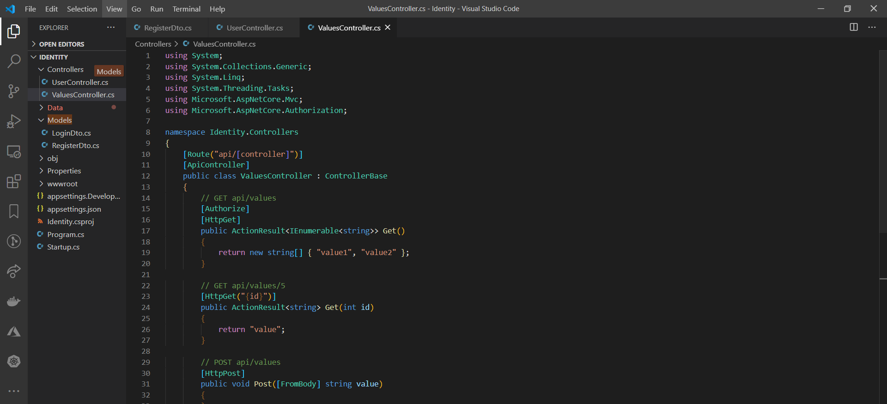

### Exercise 3: Run a client application to test the server

#### Task 1: Examine client code to retrieve access token

1. Switch to the command prompt.

2. To change the directory to the **IdentityClient** project, run the following code:

   ```bash
       cd [Repository Root]\Allfiles\Mod09\LabFiles\Lab1\Starter\IdentityClient
   ```

3. To open the project in Microsoft Visual Studio Code, run the following command:

   ```bash
       code .
   ```

4. Open the **Program.cs** file.

5. Line 13 creates a new instance of **HttpClient** which allows us to create HTTP requests.

   ```cs
       HttpClient client = new HttpClient();
   ```

6. Line 15 creates an HTTP **POST** call by using **HttpClient** and passing **username** and **password** to register a new user.

   ```cs
       HttpResponseMessage response = await client.PostAsync("https://localhost:5001/api/user/register", new StringContent("{ \"Username\": \"azure@azure.com\", \"Password\": \"Azure123!!\" }", Encoding.UTF8, "application/json"));
   ```

7. Line 16 extracts **token** by using the return result of the last call.

   ```cs
       string token = await response.Content.ReadAsStringAsync();
   ```

8. Line 17 stores the token in the header for the next authentication requests.

   ```cs
       client.DefaultRequestHeaders.Authorization = new AuthenticationHeaderValue("Bearer", token);
   ```

9. Line 18 creates an HTTP **GET** request with the token store in the header.

   ```cs
       response = await client.GetAsync("https://localhost:5001/api/values");
   ```

10. Line 19 reads the content by using the return result of the last call.

    ```cs
        string content = await response.Content.ReadAsStringAsync();
    ```

11. Line 20 writes the content to the screen.

    ```cs
        Console.WriteLine(content);
    ```

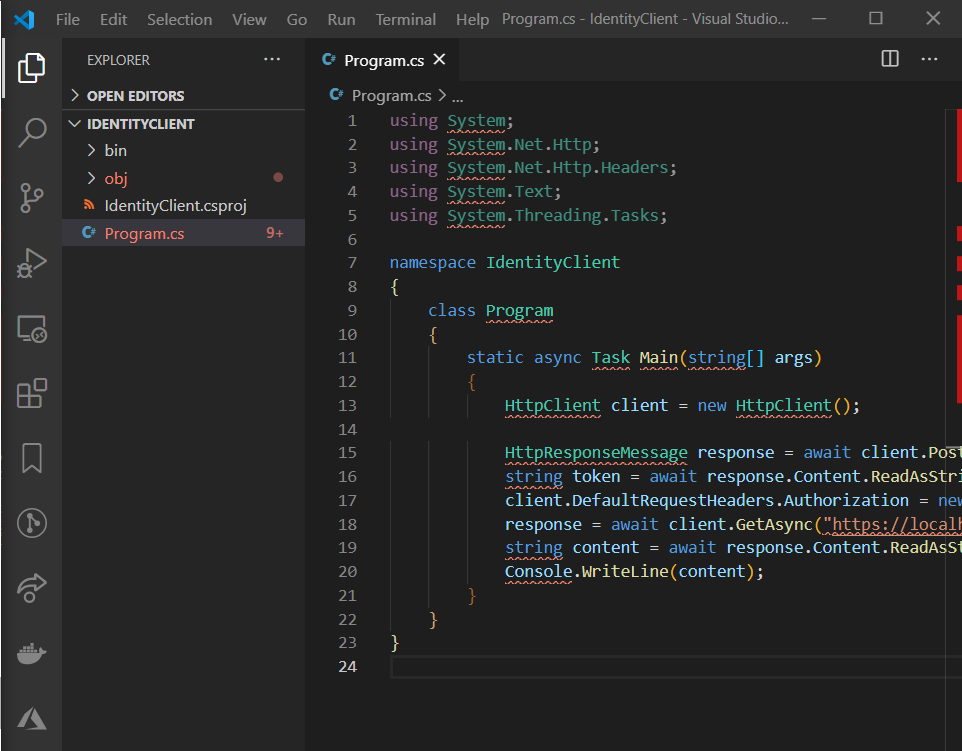

#### Task 2: Run the client code and inspect the user claims in the service

1. Switch to the command prompt.

2. To change the directory to the **Identity** project, run the following command:

   ```bash
       cd [Repository Root]\Allfiles\Mod09\LabFiles\Lab1\Starter\Identity
   ```

3. To run the project, run the following command:

   ```bash
       dotnet run
   ```

4. Open a new instance of the command prompt.

5. To change the directory to the **IdentityClient** project, run the following command:

   ```bash
       cd [Repository Root]\Allfiles\Mod09\LabFiles\Lab1\Starter\IdentityClient
   ```

6. To run the project, run the following command:

   ```bash
       dotnet run
   ```

7. Verify that **[value1, value2]** return back to the command prompt.

   

8. Close all open windows.

<span style="color:red">
   **Esta parte que viene de Azure Active Directory no se puede hacer con nuestra subscripcion**
</span>

# Lab: Using Azure Active Directory with ASP.NET Core 

### Exercise 1: Authenticate a client application by using AAD B2C and MSAL.js

### Task 1: Configure Azure Active Directory B2C

1. Open the Microsoft Azure portal.

2. In the left-hand side pane, click **+ Create a resource**

3. In the search box, type **Azure Active Directory B2C**,  from the search results, select **Azure Active Directory B2C**, and then click **Create**.

4. Select **Create a new Azure AD B2C Tenant**.

5. Enter the **Organization name** and **Initial domain name** values, and then click **Create**.

   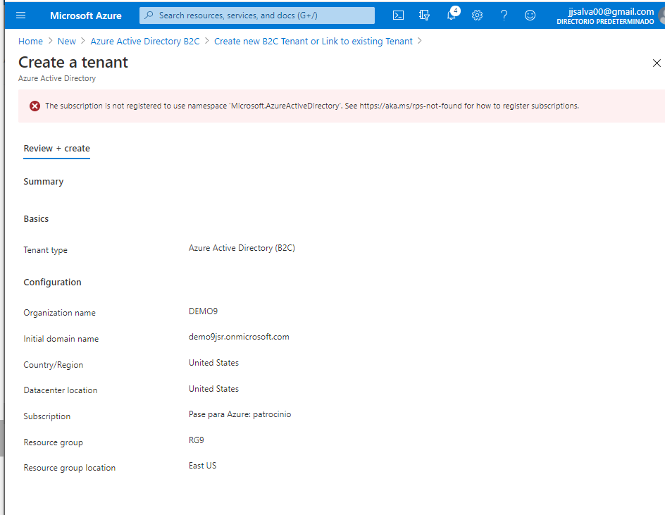

6. After the tenant is created, click **Directory+subscription**, and then select your tenant.

7. In the top left-hand side corner of the Azure portal, choose **All services**, and then search for and select **Azure AD B2C**.

8. On the blade, select **Applications** and click **Add**.

9. Enter the name of the application.

10. Under **Web App / Web API**, select **Yes**.

11. Under **Reply URL**, add **https://jwt.ms** and **https://localhost:5001/index.html**, then click **Create**

12. From the blade select **User flows (policies)**, and click **New user flow** and select **Sign-up and sign in**.

13. Enter a policy name for your application to reference.

14. Under the identity providers, select **Email signup**. Optionally, you can also select social identity providers, if already configured. Click **OK**.

15. Under the **User attributes and claims**. Choose attributes you want to collect from the consumer during sign-up. For example, select **Country/Region**, **Display Name**, and **Postal Code**. Click **Create**.

#### Task 2: Add Azure B2C Authentication

1. Open the command prompt.

2. To change the directory to the **Starter** project, run the following command:

   ```bash
   cd [Repository Root]\Allfiles\Mod09\LabFiles\Lab2\Starter
   ```

3. Create a new **ASP.NET Core** project. At the command prompt, paste the following command, and then press Enter:

   ```bash
    dotnet new webapi --name AzureActiveDirectoryB2C
   ```

4. To change the directory to the **AzureActiveDirectoryB2C** project, run the following command:

   ```bash
   cd AzureActiveDirectoryB2C
   ```

5. To open the project in Visual Studio Code, run the following command: 

   ```bash
   code .
   ```

6. Open the **Startup.cs** file.

7. At the top of the page, add the following **using** statements:

   ```cs
       using System.Text;
       using Microsoft.AspNetCore.Authentication.JwtBearer;
   ```

8. Inside the **ConfigureServices** method, before the **services.AddMvc()** line, add the following code:

   ```cs
       services.AddAuthentication(options =>
       {
           options.DefaultScheme = JwtBearerDefaults.AuthenticationScheme;
       })
       .AddJwtBearer(jwtOptions =>
       {
           jwtOptions.Authority = $"https://{Configuration["AzureAdB2C:TenantName"]}.b2clogin.com/{Configuration["AzureAdB2C:TenantName"]}.onmicrosoft.com/{Configuration["AzureAdB2C:Policy"]}/v2.0/";
           jwtOptions.Audience = Configuration["AzureAdB2C:ClientId"];
           jwtOptions.Events = new JwtBearerEvents
           {
               OnAuthenticationFailed = async arg =>
               {
                   var s = $"AuthenticationFailed: {arg.Exception.Message}";
                   arg.Response.ContentLength = s.Length;
                   await arg.Response.Body.WriteAsync(Encoding.UTF8.GetBytes(s), 0, s.Length);
               }
           };
       });
   ```

9. To the **Configure** method, before the **app.UseHttpsRedirection();** call, add the following code:

   ```cs
       app.UseAuthentication();
   ```

10. Open the **appsettings.json** file.

11. Add the following configuration and replace *[TenantName]* and *{YourInitials}* with the corresponding values.

    ```json
        "AzureAdB2C": {
            "TenantName": "[Mod09Lab02-{YourInitials}]",
            "ClientId": "[ClientId]",
            "Policy": "[B2C_1_{YourInitials}]"
        }
    ```

12. In Explorer pane, expand **Controllers** and then click **ValuesController.cs** file.

13. At the top of the page, add the following **using** statement:

    ```cs
        using Microsoft.AspNetCore.Authorization;
    ```

14. To the **Get()** method, add the following attribute:

    ```cs
        [Authorize]
    ```

### Exercise 2: Authenticate a client application by using AAD B2C and MSAL.js

#### Task 1: Add simple js client

1. Open the **Startup.cs** file.

2. To the **Configure** method, before the **app.UseAuthentication();** call, add the following code:

   ```cs
       app.UseStaticFiles();
   ```

3. In Visual Studio Code, right-click the **wwwroot** folder, select **New File**, and then name it **index.html**.

4. Add the following code:

   ```html
       <html>
           <head>
               <script src="https://secure.aadcdn.microsoftonline-p.com/lib/0.2.3/js/msal.js"></script>
               <script src="index.js"></script>
           </head>
           <body>
               <div>
                   <button onclick="login()">Login</button>
                   <button onclick="request(token)">Request</button>
                   <span id="loginStatus"></span>
                   <span id="responseData"></span>
               </div>
           </body>
       </html>
   ```

5. In Visual Studio Code, right-click the **wwwroot** folder, select **New File**, and then name it **index.js**.

6. Add the following code and replace *[TenantName]* and *{YourInitials}* with the corresponding values:

   ```js
       var applicationConfig = {
           clientID: '[ClientId]',
           authority: "https://[TenantName].b2clogin.com/[TenantName].onmicrosoft.com/B2C_1_{YourInitials}}",
       };
   
       var clientApplication = new Msal.UserAgentApplication(applicationConfig.clientID, applicationConfig.authority, authCallback, { cacheLocation: 'localStorage', validateAuthority: false });
       function authCallback(errorDesc, token, error, tokenType) {
           if (token) {
           }
           else {
               logMessage(error + ":" + errorDesc);
           }
       }
   
       var token = "";
   
       function login() {
           clientApplication.loginPopup().then(function (idToken) {
               //Login Success
               document.getElementById("loginStatus").innerText = "Login Successfully";
               token = idToken;
           }, function (error) {
               document.getElementById("loginStatus").innerText = error;
           });
       }
   
       function request(token) {
           var headers = new Headers();
           var bearer = "Bearer " + token;
           headers.append("Authorization", bearer);
           var options = {
               method: "GET",
               headers: headers
           };
   
           fetch("https://localhost:5001/api/values", options)
               .then(function (response) {
                   response.json().then(function (body) {
                       document.getElementById("responseData").innerText = JSON.stringify(body);
                   });
               });
       }
   ```

#### Task 2: Test your service

1. Switch to the command prompt.

2. To change the directory to the **AzureActiveDirectoryB2C** project, run the following command:

   ```bash
   cd [Repository Root]\Allfiles\Mod09\LabFiles\Lab2\Starter\AzureActiveDirectoryB2C
   ```

3. To run the project, run the following command:

   ```bash
   dotnet run
   ```

4. Open the browser and navigate to the following URL:

   ```
   https://localhost:5001/index.html
   ```

5. Click **Login**, and then click on **Sign up now**.

6. Fill your information in the form and click **Create**

7. To see the result, click **Request**.

8. Verify that the result **["value1","value2"]** shown on the screen.

9. Close all open windows.


  ©2018 Microsoft Corporation. All rights reserved.

The text in this document is available under the [Creative Commons Attribution 3.0 License](https://creativecommons.org/licenses/by/3.0/legalcode), additional terms may apply. All other content contained in this document (including, without limitation, trademarks, logos, images, etc.) are **not** included within the Creative Commons license grant. This document does not provide you with any legal rights to any intellectual property in any Microsoft product. You may copy and use this document for your internal, reference purposes.

This document is provided &quot;as-is.&quot; Information and views expressed in this document, including URL and other Internet Web site references, may change without notice. You bear the risk of using it. Some examples are for illustration only and are fictitious. No real association is intended or inferred. Microsoft makes no warranties, express or implied, with respect to the information provided here.
