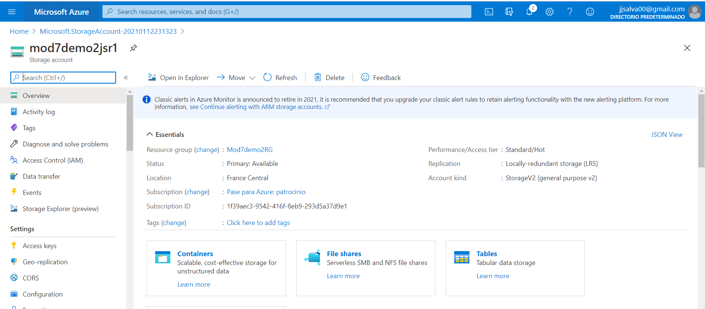
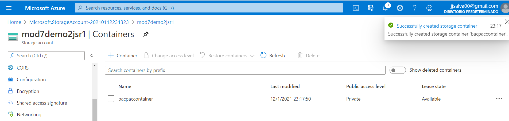
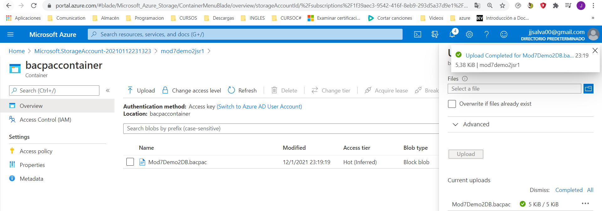
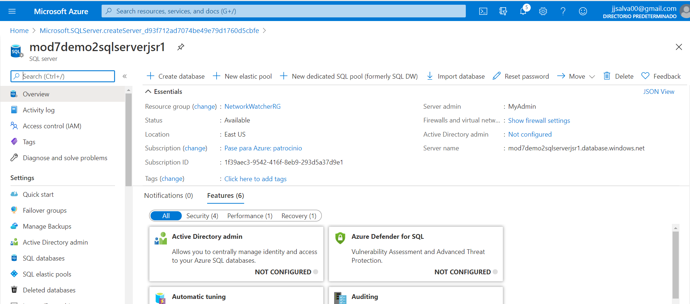
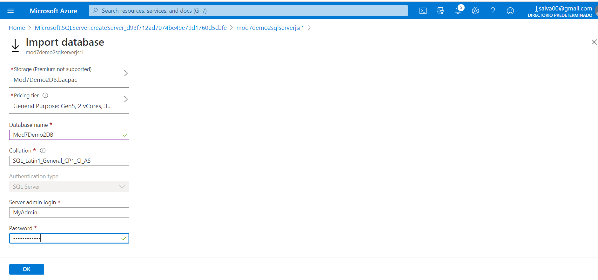
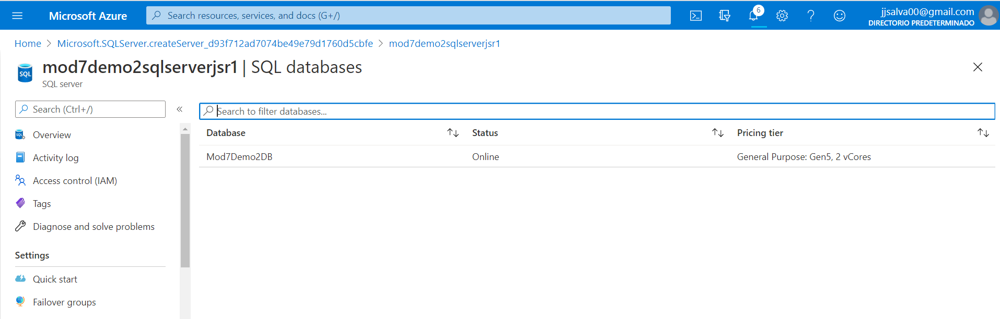
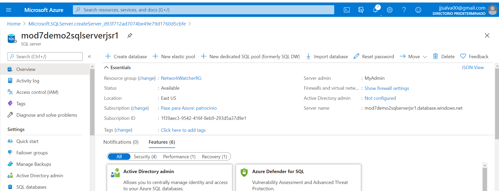
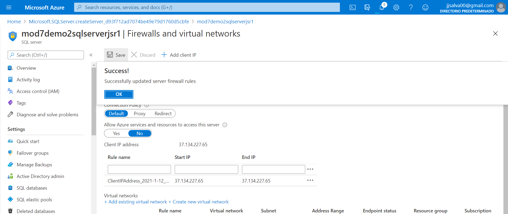
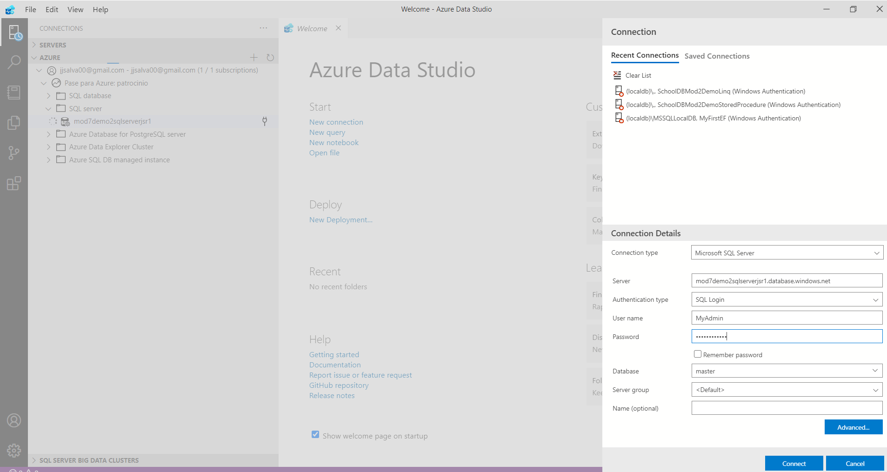
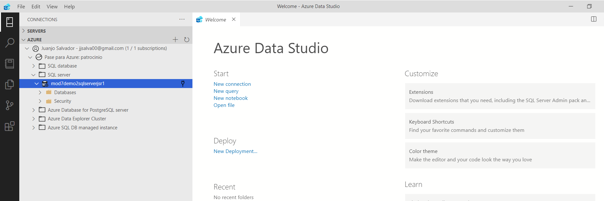

## MOD7_L3_1

### Uploading an Azure SQL Database to Azure and Accessing it Locally 

Crear **Storage accounts**.

Crear **container**.

 **Upload**. fichero de creacion de bbdd

​	Creamos **SQL server**. 

​	**Importamos la BBDD.**

​	Vemos la **bbdd** creada

**Setting Firewall**

**Añadimos la Ip**

**Open Azure Data Studio **

- La primera vez da error porque hay que meter la contraseña.

- Ahora ya conecta

  
