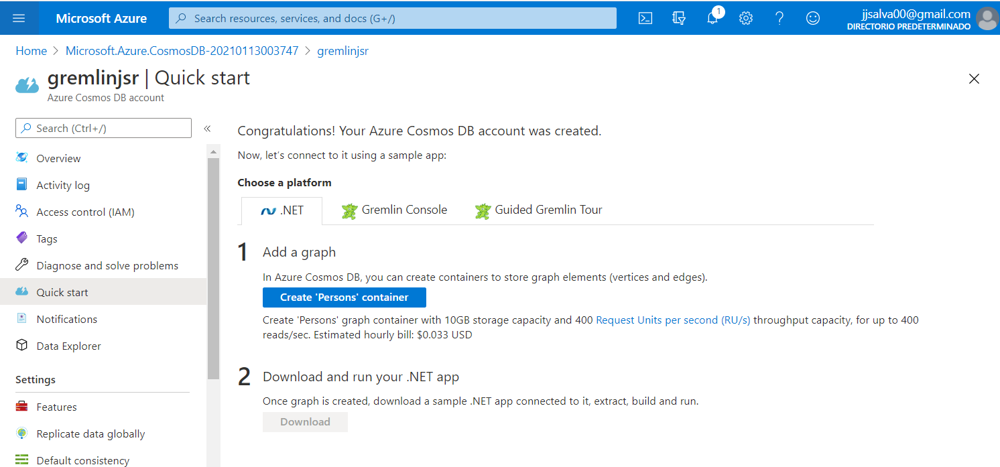
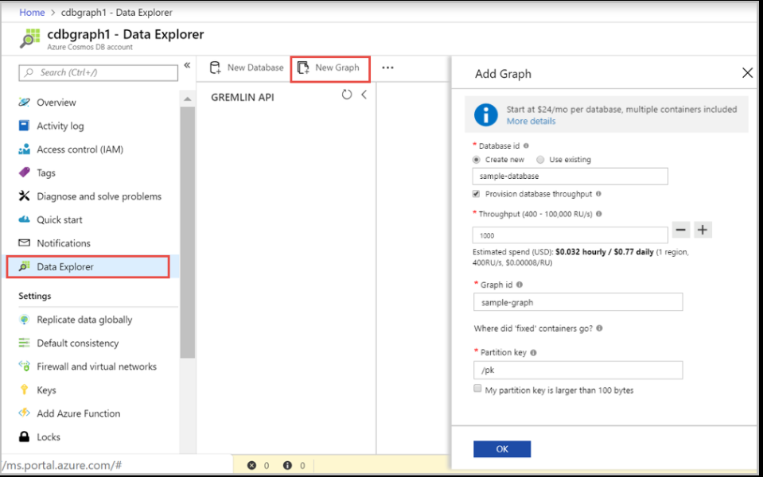
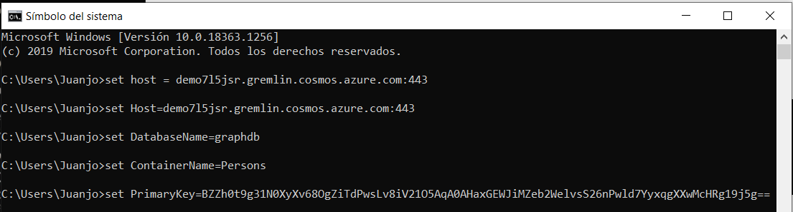
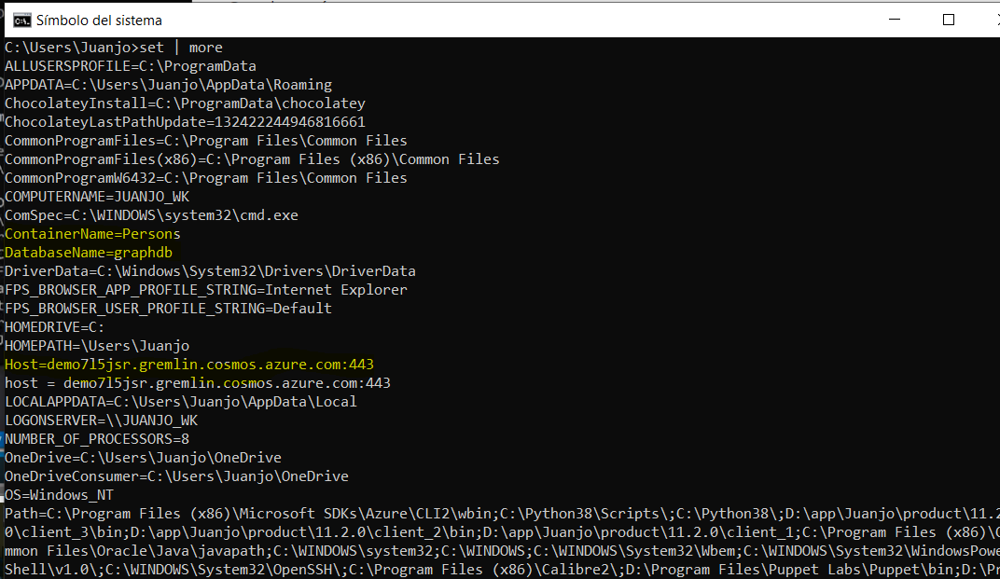
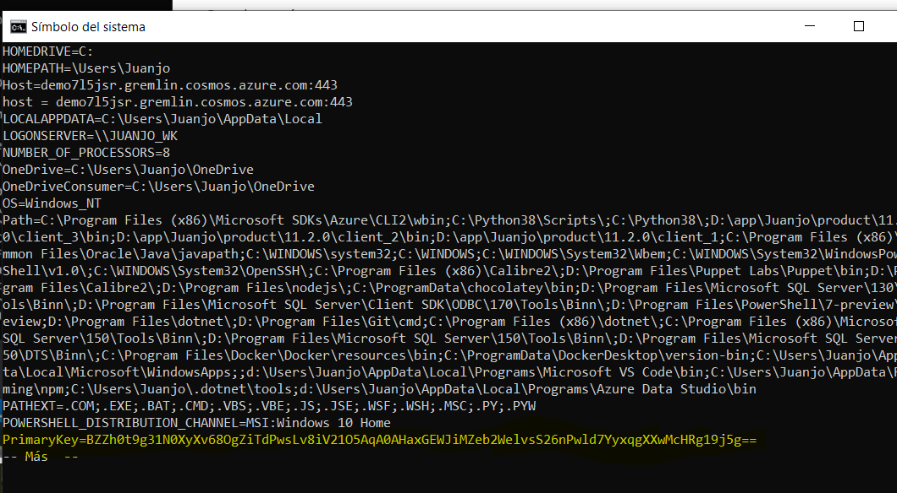
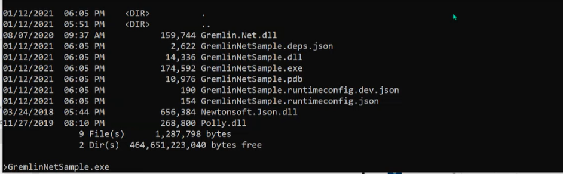
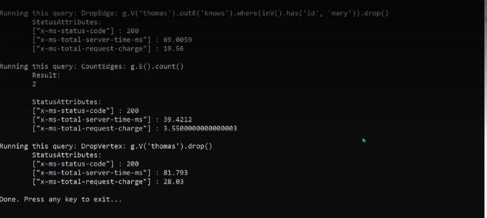
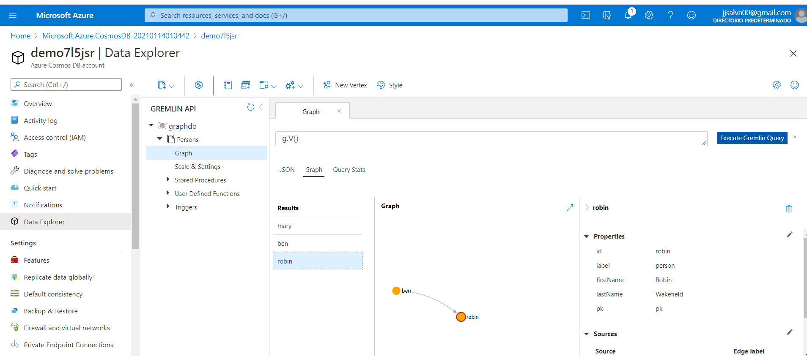
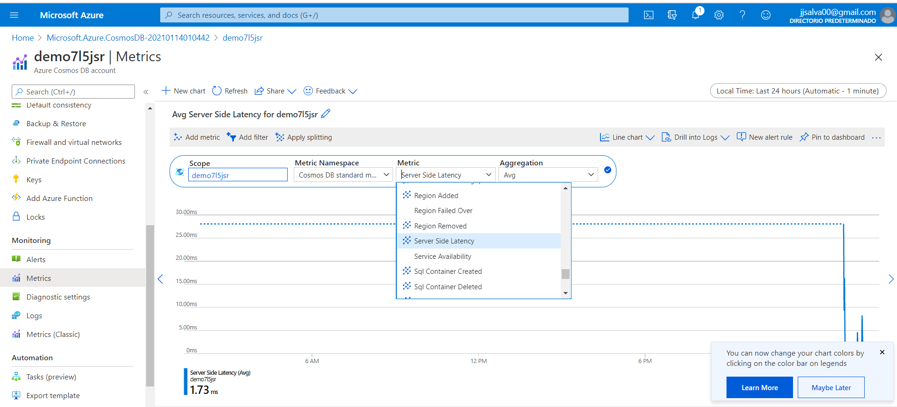

## DEMO3_L3_3

### Using Cosmos DB with a Graph Database API

**Azure** CReamos una **Azure Cosmos DB**

**Pulsamos Create 'Persons' cointainer** para crear una bbdd de Cosmos hacia el contenedor de Grafos.

**Pulsamos DataExplorer y New Graph**

Ahora  desde un Cmd o PowerShell clonamos el trabajo

**Abrimos el proyecto con el Visual Studio 2019. **

- Instalamos con el Nuget el Gremlin.Net

- Vemos el código del proyecto donde se usan estas variables:

  host	PrimaryKey  Database	Container

  - Le damos valor por cmd con datos de azure:

    

Quedan así:

**Construimos aplicación desde Visual Studio Debug Without Debugging**

**Desde linea de comando vamos a la ruta**

**Ejecutamos**

Ahora vamos al portal, en Data Explorer, graphdb, Persons, Graph y Load Graph

**Revisamos SLAs**

